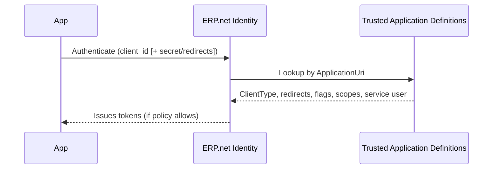

# Trusted Applications

A **Trusted Application** defines the relationship between an app and a specific @@name instance.  

It represents the app's registration record inside the instance: who the app is, which authentication modes it can use, and what access it may request.

Every app that connects to @@name APIs must first be registered as a Trusted Application in the target instance.  

This ensures that access is secure, auditable, and governed by consistent policies.

> [!NOTE]
> **One record per instance:**  
> If your app connects to multiple instances, register it separately in each.

## Relationship to @@name Identity and OAuth

In @@name, the connection between an external app and the instance relies on three cooperating components:

- **@@name Identity** – authenticates users and services and issues tokens.  
- **OAuth 2.0** – defines the standard flows for obtaining and using those tokens.  
- **Trusted Application** – defines *which* app is calling, *how* it may authenticate, and *what* access it may be granted.

Together, these components ensure that all applications are known, trusted, and subject to the instance's access rules.

## What a Trusted Application Controls

Each Trusted Application record defines several aspects of the app's identity and permissions:

- **Identity** – unique `ApplicationUri` used as the OAuth `client_id`.  
- **Client type** – whether the app is **Public** (cannot keep a secret) or **Confidential** (can keep a secret).  
- **Allowed modes** – whether the app supports user login, background service access, or both.  
- **Redirects** – approved login/logout redirect URIs for interactive sign-in.  
- **Scopes** – permissions (such as `read` or `update`) that the instance may grant.  
- **Service identity** – an optional `SystemUser` that represents the app when running as a background service.  
- **Reference token policy** – defines who can issue API keys (Personal Access Tokens or Service Access Tokens).  
- **Lifecycle** – enable or disable the app, rotate secrets, and track changes.

## Key Attributes (Essentials)

| Attribute | Purpose | Notes |
|------------|----------|-------|
| **ApplicationUri** | Unique app identifier (used as `client_id`). | Required. Use a stable, globally unique value (for example, `com.vendor/app`). |
| **ClientType** | Defines whether the app is Public or Confidential. | Public = no secret. Confidential = requires secret. |
| **ApplicationSecretHash** | SHA-256 hash of the app's client secret. | Confidential apps only. Never store plain text secrets. |
| **ImpersonateLoginUrl** | Allowed login redirect URIs. | Comma-separated list; exact match required. |
| **ImpersonateLogoutUrl** | Allowed post-logout redirect URIs. | Comma-separated list; exact match required. |
| **ImpersonateAsInternalUserAllowed** | Allows login for internal users. | Enables sign-in with internal accounts. |
| **ImpersonateAsCommunityUserAllowed** | Allows login for community or external users. | For customer or partner apps. Avoid enabling only community while disabling internal. |
| **SystemUserAllowed** | Enables background or service (non-interactive) access. | Required for client credentials flow. |
| **SystemUser** | The service account to use. | Required when `SystemUserAllowed = true`. Use a least-privilege user. |
| **Scope** | Space-delimited list of permissions. | Example: `read update`. Request only what is necessary. |
| **AccessTokens** | Controls who may issue reference tokens (PAT/SAT). | `None`, `AuthenticatedUsers`, or `AdministratorsOnly`. |
| **BasicAuthenticationAllowed** | Enables legacy Basic Auth. | Off by default. Avoid unless required. |
| **IsEnabled** | Enables or disables the app. | Acts as an immediate kill switch. |

## How @@name Identity Uses It

When an app connects to @@name, the @@name Identity validates its identity using the Trusted Application record.



## Common Configurations

### Interactive Web Application (Server-Side)

Used by web applications that authenticate users through a browser and operate from a secure backend.

**Typical setup:**

- `ClientType = Confidential`
- `ApplicationSecretHash` set with SHA-256 of the secret.
- `ImpersonateLoginUrl` and `ImpersonateLogoutUrl` define the redirect endpoints.
- `ImpersonateAsInternalUserAllowed = true` (and optionally community users).
- `SystemUserAllowed = false`
- Minimal `Scope`, typically `read` or `read update`.

**Use for:**  
Company portals, admin dashboards, or internal business apps.

### Single-Page or Native Application

Used by SPAs or device apps that cannot safely store secrets.

**Typical setup:**

- `ClientType = Public`
- `ImpersonateLoginUrl` and `ImpersonateLogoutUrl` defined for app redirect endpoints.
- Appropriate impersonation flags set for internal and/or community users.
- `SystemUserAllowed = false`
- `Scope = read` or `read update`.

**Use for:**  
Browser-based frontends, mobile apps, or desktop clients.

### Service or Integration Application

Used by background services, integration agents, or scheduled jobs that run without user interaction.

**Typical setup:**

- `ClientType = Confidential`
- `ApplicationSecretHash` set to the secret hash.
- `SystemUserAllowed = true` and `SystemUser` assigned.
- `ImpersonateAs...Allowed = false`
- `Scope = read update` or `read` only for data retrieval.

**Use for:**  
@@name integrations, synchronization tools, data migration, or automation services.

## Scopes and Access Policies

Scopes define what actions an application can perform. They are listed as space-delimited strings in the `Scope` attribute.

| Scope | Meaning | Recommended for |
|--------|----------|-----------------|
| `read` | Allows reading @@name data. | Default for most apps. |
| `update` | Allows modifying @@name data. | Required for write operations. |
| `sec` | Access to instance security infrastructure. | Reserved; not for external apps. |

> [!NOTE]
> Always follow least-privilege principles. Start with `read`, and add `update` only when required.

## AccessTokens Policy

The `AccessTokens` field controls who (if anyone) can issue **reference tokens** for the app (for example, PAT/SAT).

**Options:**

- `None` - Reference tokens cannot be issued. PAT/SAT are disabled.
- `AuthenticatedUsers` - Any signed-in user can issue reference tokens for this app.
- `AdministratorsOnly` - Only administrators can issue reference tokens.

**Guidance:**

- Start with `None`. Moving away from `None` introduces additional security risk and should be considered carefully with a clear operational need.
- If you must allow reference tokens, prefer `AdministratorsOnly`. Avoid `AuthenticatedUsers` unless there is a narrowly scoped.

## Security Guidelines

- Always use OAuth 2.0. Keep `BasicAuthenticationAllowed = false`.  
- Use **Confidential** clients for server-side apps; **Public** for SPAs and native clients.  
- Store only secret hashes; never the raw secret.  
- Rotate secrets and API keys periodically.  
- Grant the minimal required scopes.  
- Use a least-privilege `SystemUser` for service access.  
- Restrict redirect URIs to exact, HTTPS-based matches.  
- Disable unused apps with `IsEnabled = false`.  
- Audit all trusted apps periodically for owners, scopes, and usage.

## Example Minimal Setups

### Read-Only Interactive App (Internal Users)

```text
ClientType = Confidential
ImpersonateAsInternalUserAllowed = true
Scope = read
SystemUserAllowed = false
```

Used for internal dashboards or web portals where employees log in through the browser and only need to view @@name data.

### Write-Enabled Service Integration

```text
ClientType = Confidential
SystemUserAllowed = true
SystemUser = <least-privilege user>
Scope = read update
ImpersonateAs...Allowed = false
```

Used for backend integrations or scheduled jobs that must update data, such as inventory sync or reporting automation.

### Public SPA (Read-Only)

```text
ClientType = Public
ImpersonateAsCommunityUserAllowed = true
Scope = read
SystemUserAllowed = false
```

Used for front-end applications (for example, customer portals or mobile apps) that display @@name data to community users but cannot modify it.

### Hybrid App (Interactive + Service)

```text
ClientType = Confidential
ImpersonateAsInternalUserAllowed = true
SystemUserAllowed = true
SystemUser = <least-privilege user>
Scope = read update
```

Used when the same application has both an interactive UI (user sign-in) and background service features (scheduled sync or automation).

By defining Trusted Applications carefully, administrators can ensure that every integration or app connection to @@name is authenticated, authorized, and traceable - providing both flexibility and strong access control.

---

## Learn More

- [**@@name Identity**](../../auth/concepts/identity-server.md)  
  Learn about the built-in authentication authority in every @@name instance.

- [**OAuth 2.0**](../../auth/concepts/oauth2-overview.md)  
  Understand how apps obtain tokens and delegate access securely.

- [**Auth Flows**](../flows/overview.md)  
Choose and implement the right flow  

- [**Tokens**](../tokens/tokens-overview.md)  
Access tokens, scopes, and renewal  

- [**Sessions**](../sessions/overview.md)  
How tokens map to sessions and licensing
