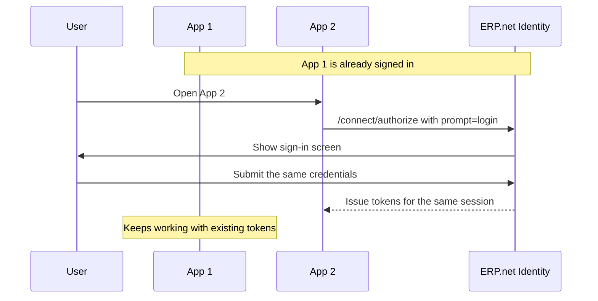

# Forcing Sign-In with prompt=login

The `prompt=login` parameter is an optional value you can include in the `/connect/authorize` request. It tells @@name Identity to show the sign-in screen even when the user is already signed in to another app in the same browser.

Use it when your app needs the user to confirm who they are, not just to receive tokens silently from an existing session.

## What it does

When your app sends `prompt=login`:

- @@name Identity displays the sign-in screen instead of issuing tokens silently.
- The user can re-enter the same credentials to confirm, or sign in as a different user.

Without `prompt=login`, and when the user already has a session from another app, @@name Identity issues tokens silently. That is the standard single sign-on (SSO) experience.

## When to use it

Send `prompt=login` when your app needs the user to prove their identity, not just to be authenticated. Typical situations:

- A sensitive action that should not inherit a generic SSO session, such as changing payment details or approving a high-value document.
- The user may be switching between identities and your app wants to confirm who is actually at the keyboard.
- Your app is one of many small apps in a marketplace and should establish its own explicit sign-in even when other apps are open in the same browser.

If none of these apply, omit the parameter. SSO will give the user the smoothest experience.

## How sessions behave

### The user re-enters the same credentials

When the user confirms by re-entering the same credentials they used elsewhere, @@name Identity keeps the existing session. This matters because:

- License slots are tracked per session. Re-confirming the same identity does not consume a second license.
- Other apps already signed in are not interrupted. They keep using their existing tokens until those tokens expire on their own.



### The user enters different credentials

When the user enters credentials for a different identity, @@name Identity creates a new session. The new app receives tokens for the new identity, and a new license slot is used. This is correct, because the user really did switch.

Apps that were signed in as the previous identity keep working with their existing tokens until those tokens expire, then go through their own sign-in.

### First sign-in

If the user has no existing session at all, `prompt=login` shows the regular sign-in screen, the same as if you had not sent the parameter.

## Example

A payments app requires fresh authentication before approving a payment, even if the user is already signed in to other apps in the same browser:

```http
GET /id/connect/authorize?
    response_type=code&
    client_id=my.payments.app&
    redirect_uri=https://payments.example.com/auth/callback&
    scope=read offline_access&
    state=xyz&
    code_challenge=Oq8sW...&
    code_challenge_method=S256&
    prompt=login HTTP/1.1
Host: instance.my.erp.net
```

The user sees the sign-in screen, enters credentials, and the app receives a fresh authorization code that it exchanges for tokens as usual.

## Things to keep in mind

- **External identity providers.** If your Trusted Application is configured to sign users in through an external provider, that provider may have its own rules for re-authentication. The `prompt=login` value tells @@name Identity to prompt, but it is not automatically forwarded to the external provider.
- **No global sign-out.** `prompt=login` does not sign the user out of @@name Identity. The existing session is preserved until the user submits new credentials, and is then updated in place. Other apps are not signed out.

---

## Learn More

- [**Step-by-Step: Authorization Code Flow**](interactive-apps-step-by-step.md)  
  Walk through the full sign-in and token exchange sequence.

- [**Tokens and Sessions Relationship**](../../sessions/token-session-relationship.md)  
  How sessions start, expire, and reconnect.

- [**License Slot Usage**](../../sessions/license-slot.md)  
  How sessions consume and release license slots.

- [**Common Errors**](interactive-apps-errors.md)  
  Troubleshooting invalid redirects, PKCE mismatches, and token issues.
