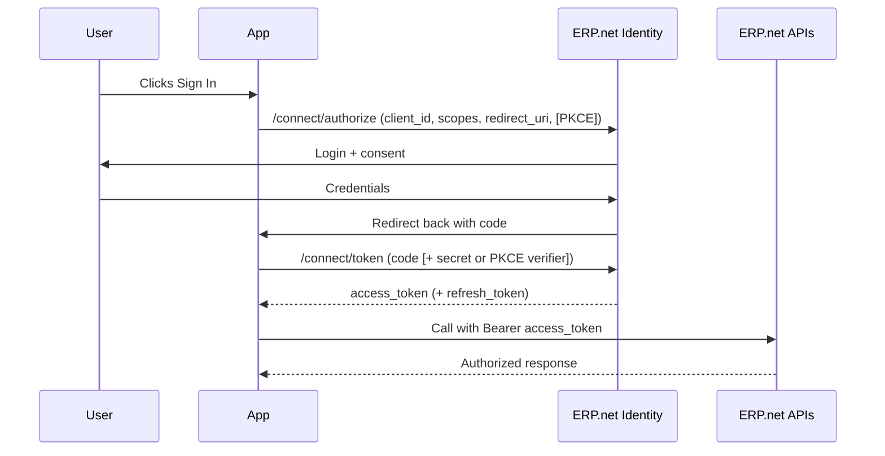

# Step-by-Step: Authorization Code Flow

This guide walks through the exact HTTP steps an interactive app takes to sign in a user with the @@name Identity, exchange the authorization code for tokens, and call the APIs.

It covers both **confidential** web apps (server-side) and **public** clients (SPAs) using **PKCE**.

## Prerequisites

Register your app as a **Trusted Application** in the target @@name instance.

Minimum required settings for a confidential web app:

| Attribute | Value | Notes |
|---|---|---|
| ApplicationUri | my.trusted.app/first | Used as `client_id` |
| ClientType | Confidential | Server-side app can keep a secret |
| ApplicationSecretHash | base64(sha256(your-secret)) | Store only the hash |
| ImpersonateAsInternalUserAllowed | true | Or community users if needed |
| ImpersonateLoginUrl | https://your-app.example.com/signin-callback | Exact HTTPS redirect URI |
| IsEnabled | true | App is active |
| Scope | read update DomainApi offline_access | Request only what you need |

> [!WARNING]
> For a public SPA, set `ClientType = Public` and omit the secret. PKCE is required.

## 1) Send the user to authorize

Your app redirects the user to the instance @@name Identity. Example query:

```http
GET /id/connect/authorize?
    client_id=my.trusted.app/first&
    redirect_uri=https://your-app.example.com/signin-callback&
    response_type=code&
    scope=read offline_access&
    state=xyz123&
    code_challenge=Oq8sW...&_pkce_&
    code_challenge_method=S256 HTTP/1.1
Host: testdb.my.erp.net
```

- `response_type=code` requests an authorization code.
- `scope` should include only what you need. `offline_access` is required if you want a refresh token.
- For public clients (SPA or native), include `code_challenge` and `code_challenge_method=S256` (PKCE).
- For confidential server apps, PKCE is recommended; client secret is used later at the token endpoint.

If everything is valid, the browser is redirected to the @@name login page.

## 2) Handle the sign-in callback

After the user signs in successfully, @@name Identity redirects back to your registered `redirect_uri` with a short-lived authorization code:

```http
GET /signin-callback?
    code=K0dE...short...GZmNjV&
    state=xyz123 HTTP/1.1
Host: your-app.example.com
```

- Validate `state` to prevent CSRF.
- Extract the `code`

## 3) Exchange the code for tokens

Your server sends a POST to the token endpoint to trade the code for tokens.

### Confidential web app (client secret)

```http
POST /id/connect/token HTTP/1.1
Host: demodb.my.erp.net
Content-Type: application/x-www-form-urlencoded

grant_type=authorization_code&
client_id=my.trusted.app/first&
client_secret=<your_plain_client_secret>&
code=K0dE...short...GZmNjV&
redirect_uri=https://your-app.example.com/signin-callback
```

### Public SPA (PKCE)

```http
POST /id/connect/token HTTP/1.1
Host: demodb.my.erp.net
Content-Type: application/x-www-form-urlencoded

grant_type=authorization_code&
client_id=my.trusted.app/first&
code=K0dE...short...GZmNjV&
redirect_uri=https://your-spa.example.com/index.html&
code_verifier=<original_random_string_used_to_build_code_challenge>
```

### Typical JSON response

```json
{
  "access_token": "<access_token>",
  "expires_in": 3600,
  "refresh_token": "<refresh_token_if_offline_access_was_requested>",
  "token_type": "Bearer",
  "scope": "read offline_access"
}
```

## 4) Call @@name APIs

Use the access token in the Authorization header:

```http
GET /api/domain/odata/Crm_Sales_Customers?$top=10 HTTP/1.1
Host: testdb.my.erp.net
Authorization: Bearer <access_token>
```

- Sessions are created when the token is first used, not when it is issued.
- If you receive `HTTP 401` after some time, the access token likely expired.

## 5) Renew the access token (if applicable)

If your app received a refresh token, renew silently:

```http
POST /id/connect/token HTTP/1.1
Host: testdb.my.erp.net
Content-Type: application/x-www-form-urlencoded

grant_type=refresh_token&
client_id=my.trusted.app/first&
client_secret=<your_plain_client_secret>&
refresh_token=<previous_refresh_token>
```

Response contains a new access token and, depending on policy, a new refresh token.

> [!NOTE]
> Client Credentials flow does not issue refresh tokens. Request a new access token when needed.

## Sequence overview



## Security best practices

- Redirect URIs must match exactly what is registered in the **Trusted Application**.
- Use **PKCE** for SPAs and all public clients.
- Keep secrets on the server only; never ship them to browsers or mobile apps.
- Request the smallest set of scopes that satisfy your feature needs.
- Handle and store refresh tokens securely; rotate if compromised.

## Full samples

[!list limit=1000 erp.type=sample erp.topic=security default-text="None"]

---

## Learn More

- [**Redirect URIs and PKCE**](interactive-apps-redirects-pkce.md)  
  How to secure redirects and apply PKCE correctly.

- [**Refresh Tokens**](interactive-apps-refresh-tokens.md)  
  How to renew tokens without requiring the user to sign in again.

- [**Trusted Applications and Access Control**](../../configuration/trusted-apps-access.md)  
  Learn how app registrations define access modes, users, and permissions.

- [**Common Errors**](interactive-apps-errors.md)  
  Troubleshooting invalid redirects, PKCE mismatches, and token issues.
