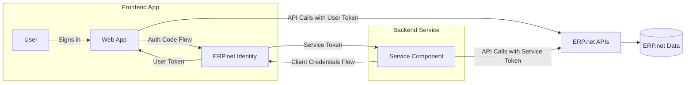

# Hybrid Apps Overview

Some applications combine **interactive user access** with **background automation or elevated operations**.  

These are known as **Hybrid Apps**, and they use *both* OAuth 2.0 flows:

- **Authorization Code Flow** for user-facing (interactive) parts.  
- **Client Credentials Flow** for backend or service components.

This pattern is ideal for apps that need to securely connect user sessions with backend logic while maintaining proper isolation between the two.

## Why Hybrid?

Hybrid apps let you safely combine user and system contexts in one solution.

| Purpose | Flow | Who Authenticates | Example |
|----------|------|-------------------|----------|
| User-facing front end | Authorization Code | User | Web portal, dashboard, mobile app |
| Background or elevated operations | Client Credentials | Application (System User) | Background sync, import/export, scheduled automation |

> [!NOTE]  
> Even though both flows may belong to the same logical application, they use *separate credentials, tokens, and sessions* - ensuring the backend cannot impersonate a user and vice versa.

## Typical Use Cases

- **Web app + background worker**  
  A user-facing portal (Authorization Code) triggers backend sync jobs (Client Credentials).

- **Mobile app + cloud API service**  
  The mobile app signs in users; a separate server component manages uploads or scheduled tasks.

- **Enterprise integration**  
  The web UI uses user tokens for data entry; backend agents run elevated batch updates under a System User.

- **External user portals**  
  A perfect fit when your frontend targets **external @@name users** (for example, partners or customers).  
  These users authenticate for identity purposes only - not for creating @@name sessions.  
  The backend then operates using the **Client Credentials flow**, so all API calls share a **single, stable session** managed by the service identity.  
  This setup minimizes session usage and isolates data access securely.  

## Key Benefits

- **Separation of duties** – users act within their own permissions; backend code runs as a service account.  
- **Security and compliance** – no sharing of user credentials for automation.  
- **Consistency** – both components authenticate through the same @@name Identity and share configuration via their Trusted Application.
- **Efficiency for external users** – external logins establish identity only, while all @@name interactions occur under one backend session.

## Relationship to Trusted Applications

A Hybrid App is usually represented by a **single Trusted Application** in @@name configured as:

| Attribute | Value | Purpose |
|------------|--------|----------|
| `ClientType` | Confidential | Keeps a secret securely on the backend. |
| `ImpersonateAsInternalUserAllowed` | `true` | Enables user sign-in for the front end. |
| `ImpersonateAsCommunityUserAllowed` | `true` | Enables external users (partners/customers) to authenticate for identity. |
| `SystemUserAllowed` | `true` | Enables background or service access. |
| `SystemUser` | `<service_user>` | Defines which user identity the backend uses. |
| `Scope` | `read update` | Specifies permissions available to both flows. |

> [!NOTE]  
> This design allows one app identity to handle both interactive and background operations while maintaining strict isolation of tokens and permissions.  
> For external-facing apps, it also ensures that @@name session consumption happens **only once** - through the service component using Client Credentials.

## Token Flows in Action

- The **frontend** uses Authorization Code Flow for user sessions.
- The **backend** uses Client Credentials Flow for automation.
- Both call the same APIs, but under different tokens and permissions.

## Best Practices

- Always **store user and service tokens separately**. Never reuse or mix them.
- Implement **token caching** per flow to avoid unnecessary re-authentication.
- Use **refresh tokens** only for the Authorization Code flow.
- Configure minimal scopes; typically, the backend requires broader permissions than the user front end.
- Audit your Trusted Application and System User regularly.

---

## Learn More

- [**Typical Architecture**](hybrid-architecture.md)  
  Explore how hybrid apps structure front-end and backend communication.

- [**Example Scenarios**](hybrid-examples.md)  
  See how real hybrid patterns are implemented in practice.

- [**Trusted Applications and Access Control**](../../configuration/trusted-apps-access.md)  
  Understand how System User and impersonation settings define hybrid access.
