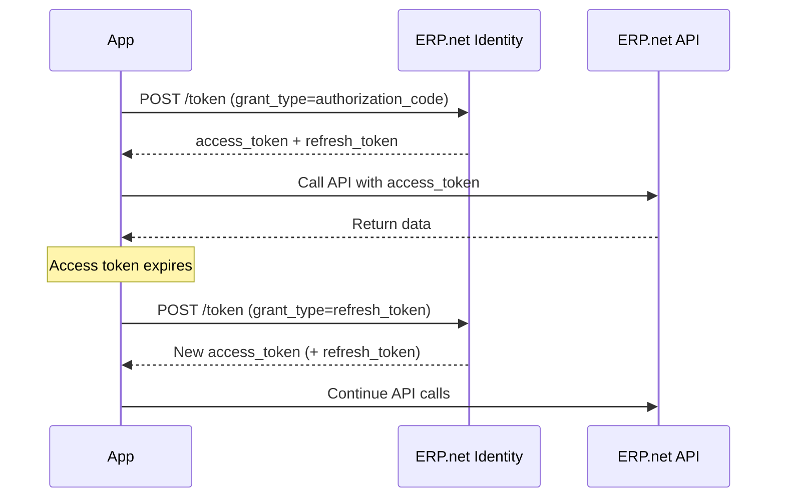

# Refresh Tokens in Interactive Apps

Interactive applications that use the **Authorization Code flow** can receive a **refresh token** together with their access token.  

A refresh token allows the app to obtain new access tokens without requiring the user to sign in again.

This enables a smoother experience for users and helps maintain secure, continuous access to @@name APIs.

> [!NOTE]  
> Refresh tokens are **only available to interactive apps** using the Authorization Code flow.  
> They are **not issued** for the Client Credentials flow or non-interactive service apps.

## How Refresh Tokens Work

1. The app completes the **Authorization Code flow** and receives:
   - An **access token** – short-lived, used for API calls.
   - A **refresh token** – long-lived, used to request new access tokens.

2. When the access token expires, the app calls the **token endpoint** again, this time using the refresh token.

3. @@name Identity validates the refresh token and issues a **new access token** (and possibly a new refresh token).

4. The app replaces the expired token and continues calling the API without user interaction.



## Requesting a Refresh Token

To receive a refresh token, the app must include the `offline_access` scope when requesting authorization:

```http
GET /id/connect/authorize?
    client_id=my.trusted.app&
    redirect_uri=https://localhost/signin-callback&
    response_type=code&
    scope=openid profile offline_access DomainApi&
    state=xyz
```

The `offline_access` scope signals that the app wants permission to act on behalf of the user even when they are not actively signed in.

## Exchanging a Refresh Token

When your access token expires, send a new request to the token endpoint:

```http
POST /id/connect/token HTTP/1.1
Host: demodb.my.erp.net
Content-Type: application/x-www-form-urlencoded

client_id=my.trusted.app&
client_secret=<my_secret>&
grant_type=refresh_token&
refresh_token=<your_refresh_token>
```

### Example Response

```json
{
  "access_token": "eyJhbGciOiJSUzI1NiIs...",
  "expires_in": 3600,
  "refresh_token": "SvQvQ9cxcYzs0AWg6tsGW1-YK7O5xP...",
  "scope": "openid profile DomainApi offline_access"
}
```

Use the new access token for subsequent API calls.

> [!WARNING]
> Each refresh issues a new refresh token.
> Always store the latest one, as older tokens will be revoked.

## Token Lifetime and Renewal

| Token Type | Typical Lifetime | Renewable | Notes |
|-------------|------------------|------------|-------|
| **Access Token** | Short-lived (1 hour) | Yes (via refresh token) | Short-lived for security |
| **Refresh Token** | Long-lived (1 month) | Yes, until revoked | Use to obtain new access tokens |

## Best Practices

- Always request `offline_access` **only when needed**.  
- Store refresh tokens securely (encrypted and server-side).  
- Handle token renewal **transparently** for users.  
- Implement fallback to full login if the refresh token fails.  
- Always update your stored refresh token with the latest one issued.

## Example: Refresh Token Renewal

```http
POST /id/connect/token HTTP/1.1
Host: demodb.my.erp.net
Content-Type: application/x-www-form-urlencoded

client_id=my.trusted.app&
client_secret=<my_secret>&
grant_type=refresh_token&
refresh_token=<old_refresh_token>
```

Response:

```json
{
  "access_token": "new_access_token_value",
  "refresh_token": "new_refresh_token_value",
  "expires_in": 3600
}
```

Replace your existing tokens with these new ones and continue using the API.

---

## Learn More

- [**Interactive Apps (Authorization Code Flow)**](overview.md)  
  How interactive apps sign in and obtain tokens.

- [**Redirect URIs and PKCE**](interactive-apps-redirects-pkce.md)  
  Securing redirects and preventing code interception.

- [**Trusted Applications and Access Control**](../../how-apps-connect/trusted-apps-access.md)  
  Learn how app configuration affects token issuance.

- [**Common Errors**](interactive-apps-errors.md)  
  Handling invalid or expired refresh tokens.
