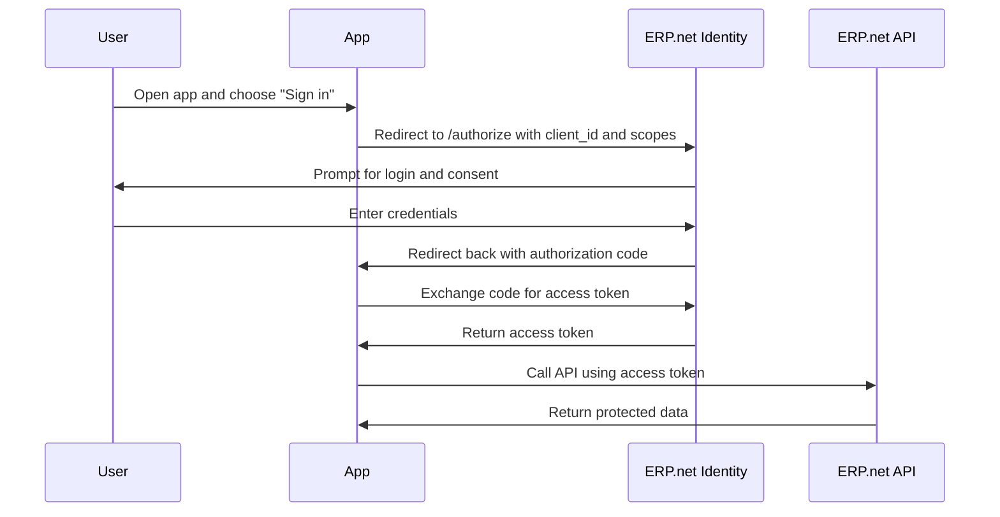
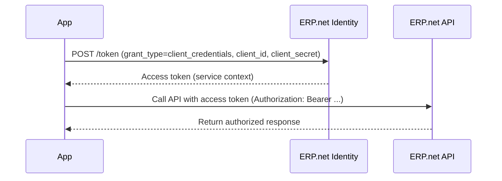
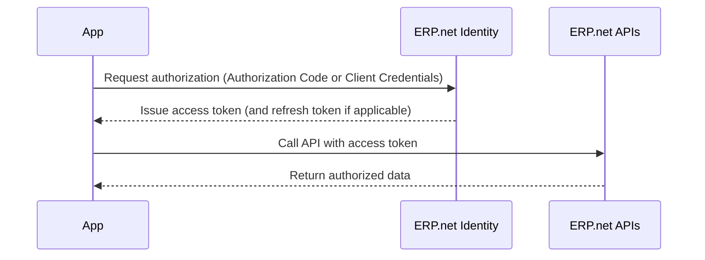

# OAuth 2.0

@@name uses the **OAuth 2.0 authorization protocol** to let applications obtain controlled access to its APIs without handling user credentials directly.  

OAuth 2.0 separates **authentication** from **authorization**, allowing an app to act on behalf of a user or as a service, under explicitly granted permissions.

> [!NOTE]
> Internally, @@name may use OpenID Connect for user identity. External developers only need standard OAuth 2.0 concepts and flows described here.

## Why OAuth 2.0

Historically, applications asked for usernames and passwords and then called APIs directly.

This is risky and hard to control. OAuth 2.0 replaces passwords with access tokens issued by a trusted authority, so apps can:

- Authenticate securely via the @@name Identity
- Request only the permissions they need
- Call APIs with a verifiable token instead of user credentials
- Be audited and revoked centrally

> [!NOTE]
> In @@name, the *trusted authority* that issues and validates tokens is the built-in **@@name Identity** within each instance.

## Core Roles

- **Client (App)** - Your application that requests access. In @@name it is registered as a **Trusted Application**.
- **Resource Owner (User or Organization)** - The entity that owns the data.
- **Authorization Server** - The @@name **Identity** that issues tokens after successful authentication and authorization.
- **Resource Server** - The **@@name APIs** that validate tokens and enforce permissions.

> [!NOTE]
> @@name Identity also acts as an **authentication server**, verifying user or service credentials before any tokens are issued.

## Supported Grants in @@name

@@name supports the standard OAuth 2.0 grants used by modern applications.

> [!NOTE]
> A **grant** in OAuth 2.0 is the method an application uses to obtain an access token.
> Different grant types define *how* the app proves who it is and whether a user is involved in the process.

### Authorization Code

Used by interactive apps that act on behalf of a signed-in user.

- Typical clients: web apps, SPAs using a backend, mobile apps with a web view
- Properties:
  - User is redirected to the ERP.net Identity to sign in
  - App receives an authorization code, then exchanges it for an access token
  - Can support refresh tokens for confidential clients
- When to use: any app with a user interface and user-specific access

> [!NOTE]
> Note: This flow is used by web apps, SPAs, and desktop clients that require user authentication and access on behalf of that user.

### Client Credentials

Used by service or background apps that act as themselves, not a user.

- Typical clients: integrations, schedulers, background workers
- Properties:
  - No user interaction
  - App authenticates as a configured service identity in its Trusted Application record
- When to use: automation and system-to-system integration

> [!NOTE]
> In @@name, client-credentials access is governed by the app's Trusted Application configuration (e.g., service permissions).
> Refresh tokens are not issued for the client credentials grant; request a new access token when needed.

> [!NOTE]
> A single app can use both models when appropriate.
> For example, a web app may sign in users via Authorization Code flow, and also perform background synchronization via Client Credentials.

## Tokens at a Glance

- **Access token** - A signed artifact presented to @@name APIs to prove authorization
- **Refresh token** - A long-lived token that allows obtaining new access tokens without user interaction
- **Reference token (API key)** - An opaque, manually issued token that represents long-lived delegated access (either user-based as a PAT or service-based as a SAT)  
- **Scopes** - Named permissions that describe what the token allows

In @@name, issuing an access token does not automatically create a session.  

The token itself is only a signed proof of granted access.  

A session is created (or reactivated) only when that token is first used to call an API within the instance.

See [Sessions](../sessions/overview.md) for details about session behavior and licensing.

### Refresh tokens

- Issued only to appropriate interactive confidential clients using Authorization Code flow
- Not issued for Client Credentials flow
- See [Token Lifetime and Renewal](../tokens/token-lifetime.md) for renewal behavior and policies

### Reference Access Tokens (API Keys)

**Reference tokens** are opaque, long-lived API keys issued explicitly for an app.  

They are not self-contained JWTs; the instance resolves them to a session at use time.

- **Lifetime:** Long-lived, set manually at issuance (until revoked or expired).
- **Scopes:** Limited to the permissions granted to the app (and, for PAT, the user).
- **Best for:** Scripts, CI/CD, headless integrations where browser sign-in isn't practical.
- **Security:** Store securely, rotate regularly, and revoke immediately if exposed.

Types

- **PAT (Personal Access Token):** Tied to a specific user; calls run with that user's permissions.
- **SAT (Service Access Token):** Tied to a service identity; calls run with the app's service context.

> [!NOTE]
> Because they are reference (opaque) tokens, the @@name instance looks them up on each request and enforces current policies, scopes, and revocations.

## Scopes and Permissions

Scopes describe what an issued token is allowed to do.  

They are requested by the app and evaluated by the instance when issuing tokens.  

See [Scopes and Permissions](../tokens/scopes.md) for details and examples.

## High-level Flow

## How OAuth 2.0 Fits into @@name

1. Your app is registered as a **Trusted Application** in the target @@name instance.  
2. The app uses an **OAuth 2.0 flow** to authenticate with **@@name Identity**.  
3. @@name Identity issues a **token** that encodes the identity and allowed scopes.  
4. The app calls **@@name APIs** with that token, and the APIs enforce permissions.  

This model keeps credentials out of applications, centralizes access control, and makes every call auditable.

## OAuth 2.0 Quick Reference

| Flow | Who Authenticates | Interaction Type | Token Lifetime | Refresh Token Support | Typical Use Case |
|------|-------------------|------------------|----------------|------------------------|------------------|
| **Authorization Code** | User | Interactive (browser or web view) | Short-lived access token | Yes | Web apps, mobile apps, SPAs with backend |
| **Client Credentials** | Application (service identity) | Non-interactive | Short-lived access token | No | Integrations, background jobs, automations |
| **Authorization Code + Refresh** | User | Interactive with silent renewal | Access token + long-lived refresh token | Yes | Long-running web or desktop sessions |
| **Reference Token (API Key)** | User (PAT) or Service (SAT) | Non-interactive | Long-lived, manually defined | No | CI/CD pipelines, scripts, or integrations without user login |
| **Basic Authentication** *(legacy)* | User | Interactive | Session-based | No | Legacy SDK or direct API integrations *(not recommended)* |

> [!NOTE]  
> All flows rely on the same @@name Identity, which validates credentials, applies policies, and issues signed OAuth 2.0 tokens.

---

## Learn More

- [**Trusted Applications and Access Control**](trusted-apps-access.md)  
Register and configure your app inside an @@name instance  

- [**Auth Flows**](../flows/overview.md)  
Choose and implement the right flow  

- [**Tokens**](../tokens/tokens-overview.md)  
Access tokens, scopes, and renewal  

- [**Sessions**](../sessions/overview.md)  
How tokens map to sessions and licensing
