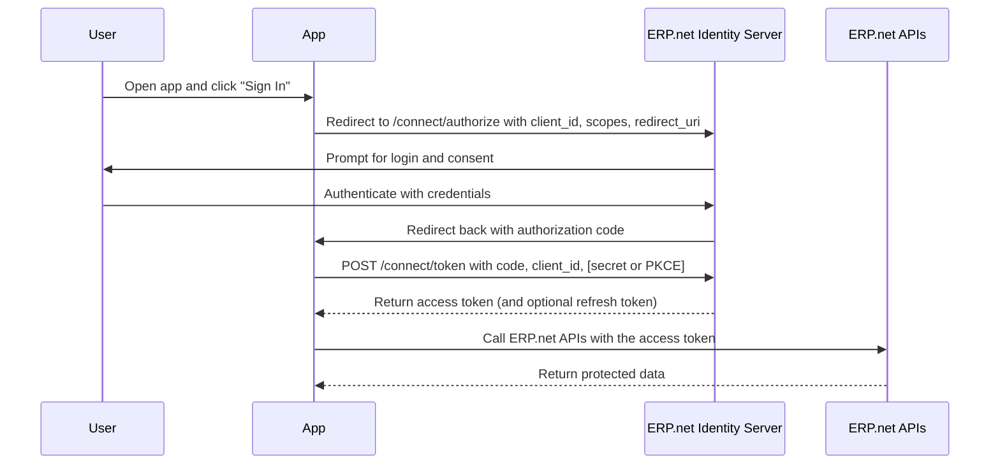

# Interactive Apps (Authorization Code Flow)

Interactive applications connect to @@name using the **Authorization Code flow** - the standard OAuth 2.0 pattern for securely authenticating users and obtaining tokens on their behalf.

This flow is used by web, desktop, and mobile apps that have a **user interface** and require access to data under the signed-in user's permissions.

## When to Use

Use this flow when your application:

- Has a user interface where people sign in (browser, desktop, or mobile).  
- Needs access to user-specific data or permissions.  
- Should never handle user passwords directly.  
- Can securely handle redirect URIs and (if confidential) a client secret.

## How It Works

The Authorization Code flow separates user authentication from API access.  

The app redirects the user to the @@name instance's **Identity Server**, where the user signs in.  

After successful authentication, the Identity Server issues a short-lived **authorization code**, which the app exchanges for an **access token** (and optionally a refresh token).

The app then uses the access token to call @@name APIs on behalf of the user.

> [!NOTE]  
> Tokens are issued by the **Identity Server** of the target @@name instance.  
> Each instance validates and authorizes the app through its Trusted Application configuration.

## Trusted Application Relationship

Before an interactive app can connect to an @@name instance, it must be registered as a **Trusted Application**.  
The Trusted Application record defines:

- The app's **identity** (`ApplicationUri`, used as `client_id`).  
- Whether the app is **Public** (no secret) or **Confidential** (uses a client secret).  
- The **redirect URIs** allowed for login and logout.  
- Which **users** can authenticate (internal or community).  
- The **scopes** and permissions the app can request.

During the sign-in process, the Identity Server checks the app's registration, validates the redirect URI, and ensures the scopes requested match the Trusted Application configuration.

> [!NOTE]  
> If the app is not registered or its configuration does not match, the Identity Server will reject the authentication request.

## Security Highlights

- **Redirect URIs** must exactly match the ones registered in the Trusted Application.  
- **PKCE (Proof Key for Code Exchange)** is mandatory for SPAs and public clients.  
- **Client secrets** must only be used by secure, confidential clients (for example, backend servers).  
- Access tokens are **short-lived** and can be renewed via **refresh tokens** if permitted.  

## Example Clients

| App Type | Example | Client Type | Notes |
|-----------|----------|-------------|-------|
| Web App (Server-side) | Internal portal, admin dashboard | Confidential | Uses client secret; refresh tokens allowed |
| SPA (Browser-based) | Customer portal, analytics dashboard | Public | Uses PKCE; no client secret |
| Mobile App | Field service or sales app | Public | Uses PKCE; must secure redirect handling |

## Typical Sequence Summary

1. User opens the app and selects **Sign In**.  
2. App redirects to @@name Identity Server for authentication.  
3. The Identity Server checks the Trusted Application configuration (redirects, scopes, client type).  
4. The user signs in and grants consent.  
5. Identity Server redirects back to the app with an authorization code.  
6. The app exchanges the code for an access token.  
7. The app uses the token to call @@name APIs.  
8. If allowed, the app silently renews the token using a refresh token.

> [!WARNING]  
> Always request only the **scopes** your app truly needs.  
> Smaller scopes mean safer tokens and fewer consent prompts.

---

## Learn More

- [**Step-by-Step Example**](interactive-apps-step-by-step.md)  
  Walk through the full login and token exchange sequence.

- [**Redirect URIs and PKCE**](interactive-apps-redirects-pkce.md)  
  How to secure redirects and apply PKCE correctly.

- [**Refresh Tokens**](interactive-apps-refresh-tokens.md)  
  How to renew tokens without requiring the user to sign in again.

- [**Trusted Applications and Access Control**](../../how-apps-connect/trusted-apps-access.md)  
  Learn how app registrations define access modes, users, and permissions.

- [**Common Errors**](interactive-apps-errors.md)  
  Troubleshooting invalid redirects, PKCE mismatches, and token issues.
