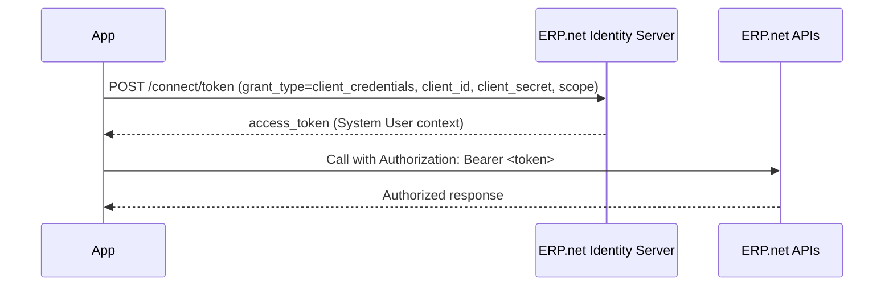

# Service and Background Apps (Client Credentials Flow)

Service applications connect to @@name using the **Client Credentials** grant.

They run without user interaction and receive tokens that represent the app's configured **System User**.

Use this flow for integrations, schedulers, imports, exports, and daemon services.

## When to use

- No user signs in; the app runs unattended.
- You need stable access under a known identity.
- The app can securely store a **client secret** (Confidential client).
- Operations should run with permissions of a least-privilege **System User**.

## How it works

1. The app authenticates to the @@name **Identity Server** with its `client_id` and `client_secret`.
2. @@name Identity Server validates the app against its **Trusted Application** record.
3. If allowed, it issues a short-lived **access token** that represents the app's **System User**.
4. The app calls @@name APIs with the token.
5. When the token expires, the app requests a new one.

> [!NOTE]
> Client Credentials flow does not issue refresh tokens. Request a new access token when needed.

## Trusted Application requirements

- `ClientType = Confidential`
- `SystemUserAllowed = true`
- `SystemUser = <least-privilege account>`
- `Scope` lists only the permissions the service needs
- `IsEnabled = true`

## Security highlights

- Store the client secret securely; never embed in public code.
- Use a dedicated **System User** with least privilege.
- Rotate secrets and the System User password periodically.
- Log token requests and API calls for auditing.

---

## Learn More

- [**Step-by-Step Example**](service-apps-step-by-step.md)  
  Minimal sequence to obtain a token and call the APIs.

- [**Token Request and Response**](service-apps-token.md)  
  Exact parameters, examples, and response fields.

- [**Common Errors**](service-apps-errors.md)  
  Quick fixes for invalid_client, invalid_scope, and more.

- [**Trusted Applications and Access Control**](../../how-apps-connect/trusted-apps-access.md)  
  Configure System User, scopes, and policies.

- [**Choosing the Right Flow**](../choosing-flow.md)  
  When to use Client Credentials vs interactive or hybrid.
