# Typical Architecture – Hybrid Apps

Hybrid apps combine interactive frontends and backend services into a single connected solution.  

Each part authenticates separately using its own flow - yet both operate under the same Trusted Application identity.

## Layered Architecture

A typical hybrid app consists of three main layers:

| Layer | Role | Authentication Flow |
|--------|------|---------------------|
| **Frontend** | User interface where people sign in. Handles presentation, lightweight API calls, and UI logic. | Authorization Code |
| **Backend Service** | Secure server process performing business logic, @@name API calls, background sync, and elevated operations. | Client Credentials |
| **@@name Instance** | Includes the Identity Server for authentication and the @@name APIs for data access. | Both |

The separation ensures clean boundaries between user identity and system identity while allowing shared configuration through a single Trusted Application.

## Communication Flow

In this setup:

- The **frontend** authenticates the user for identity purposes (no direct @@name data access).  
- The **backend** uses its service token to communicate securely with @@name APIs.  
- The **frontend** and **backend** communicate over a protected internal channel (e.g., HTTPS REST, gRPC, or GraphQL).  

---

## Deployment Models

Hybrid apps can be deployed in different configurations depending on scale and security needs.

| Model | Description | Use Case |
|--------|--------------|----------|
| **Monolithic** | Frontend and backend hosted together (same domain, single deployment). | Small internal portals or low-traffic partner apps. |
| **Distributed (2-tier)** | Frontend hosted separately (e.g., SPA in CDN) and backend hosted securely behind firewall or cloud function. | Common for SaaS portals and external-facing apps. |
| **Microservice-based** | Backend logic split into independent services sharing the same Trusted Application identity. | Complex integrations, high scalability, or multiple business domains. |

> [!NOTE]  
> For external-facing scenarios, the backend should reside in a controlled environment - the frontend never holds secrets and communicates through HTTPS to the backend only.

---

## Token Boundaries

Hybrid apps maintain strict token separation:

| Token Type | Used By | Scope | Lifetime | Storage |
|-------------|----------|--------|-----------|----------|
| **User access token** | Frontend | Identity and UI context only | Short (1 hour) | Browser memory or secure storage |
| **Service access token** | Backend | @@name API access | Short (1 hour) | Server memory or cache |
| **Refresh token** | Frontend (optional) | Renew user access token | Long (30 days) | Secure server-side store |
| **SystemUser** | Backend (Trusted Application) | @@name service identity | Static | Stored in configuration only |

> [!WARNING]
> Never pass a backend (service) token to the frontend or the client device.

---

## Example: External Portal Pattern

This pattern is ideal when the app serves **external @@name users** (partners, vendors, or customers):

- The frontend authenticates external users only for *identity* (no @@name session is created).  
- The backend, using the **Client Credentials flow**, holds a single @@name session tied to its **SystemUser**.  
- All API operations go through the backend, so @@name sees one session - minimal licensing overhead and maximum isolation.

```mermaid
flowchart LR
  U[🌐 External User] -->|Login| FE[💻 Frontend]
  FE -->|API Request| BE[⚙️ Backend Service]
  BE -->|Service Token| ERP[🧩 ERP.net APIs]
  ERP --> D[(📊 ERP.net Data)]
```

This structure:

- Keeps @@name sessions centralized (only one service session).  
- Maintains external user identity separately for auditing.  
- Scales easily - multiple users share the same backend connection.

---

## Best Practices

- Keep frontend and backend token stores separate.  
- Use short token lifetimes; rely on backend caching for reuse.  
- Ensure the frontend never handles secrets or client credentials.  
- Log all token exchanges and backend operations for auditing.  
- Implement HTTPS end-to-end (browser → backend → @@name).  
- Assign a **least-privilege System User** for backend operations.  

---

## Learn More

- [**Example Scenarios**](hybrid-examples.md)  
  Practical hybrid implementations for common @@name patterns.

- [**Trusted Applications and Access Control**](../../how-apps-connect/trusted-apps-access.md)  
  Configure impersonation and SystemUser access for hybrid apps.
