# Authentication Flows Overview

Every app connecting to @@name must follow an **OAuth 2.0 authentication flow** - a specific sequence of steps for obtaining and using tokens securely.  

Choosing the right flow depends on **how your app interacts with users** and **how it connects to the APIs**.

All flows are handled by @@name **Identity Server**.

## Why Flows Matter

Each app has a different way of connecting:

- Some apps have users who sign in and work interactively.  
- Others run in the background or on a schedule with no user present.  
- Some do both - a user-facing front end and an automated backend.

To support these patterns securely, @@name provides **two OAuth 2.0 flows** that can be used separately or together.

## Supported Authentication Flows

| Flow | Who Authenticates | Interaction | Typical Use Case |
|------|-------------------|--------------|------------------|
| **Authorization Code** | User | Interactive (via web browser) | Web apps, SPAs, mobile clients |
| **Client Credentials** | Application (service identity) | Non-interactive | Integrations, background jobs, schedulers |
| **Hybrid (combined)** | Both | Mixed | Apps that include both an interactive front end and a service backend |

> [!NOTE]  
> Hybrid apps combine both flows: the **front end** uses Authorization Code for user access, while the **backend** uses Client Credentials for automation or elevated access.

## How It Works

All flows follow the same secure pattern, handled by @@name Identity Server:

```mermaid
flowchart LR
  subgraph UserSide[Interactive App]
    U[👤 User] -->|Signs in| App[💻 App]
    App -->|Auth Request| IDP[🛡️ ERP.net Identity Server]
    IDP -->|Access Token| App
  end

  subgraph ServiceSide[Service or Backend]
    S[⚙️ Background Service] -->|Token Request| IDP
    IDP -->|Access Token| S
  end

  App -->|API Calls| API[🎛️ ERP.net APIs]
  S -->|API Calls| API
  API --> D[(📊 ERP.net Data)]
```

> [!NOTE]
> Every flow leads to the same outcome:  
> a **token** issued by the Identity Server that defines *who* or *what* is calling the APIs, and *what it's allowed to do*.

## Choosing a Flow

When selecting a flow, focus on how your app interacts with @@name:

- If your app **has a user interface** and acts on behalf of a signed-in user - use **Authorization Code**.  
- If your app **runs without user interaction** - use **Client Credentials**.  
- If your app **has both a user-facing and a backend component** - use **Hybrid** (combine both flows).  

For detailed decision guidance, see [Choosing the Right Flow](choosing-flow.md).

## Key Points to Remember

- Every app must be **registered as a Trusted Application** in the target @@name instance.  
- Tokens are always issued by the instance's **Identity Server**.  
- **Sessions** start only when a token is first used, not when issued.  
- **Refresh tokens** are only for interactive clients.  
- **Client secrets** must never be exposed in browsers or SPAs.  
- One app can safely use both flows - just keep user tokens and service tokens separate.

---

## Learn More

- [**Interactive Apps (Authorization Code Flow)**](./auth-code/overview.md)  
  Learn how user-facing apps authenticate and obtain tokens.

- [**Service and Background Apps (Client Credentials Flow)**](./client-credentials/overview.md)  
  Understand how backend and automated apps connect securely.

- [**Hybrid Apps**](./combined/overview.md)  
  Combine front-end and backend flows in one solution.

- [**Choosing the Right Flow**](choosing-flow.md)  
  Decide which flow best fits your app.
