# Authentication Flows - The Short Version

## TL;DR

Every app that connects to @@name uses an **OAuth 2.0 flow** - a predefined way to obtain access tokens securely.

There are only two real flows, and some apps use both:

1. **Interactive apps** use the **Authorization Code flow** - a user signs in, and the app gets a token to act on their behalf.  
2. **Service apps** use the **Client Credentials flow** - no user involved; the app acts as itself.  
3. **Hybrid apps** use both - front end for users, backend for automation or elevated access.

No passwords are shared and every token is issued by @@name **Identity**.

That's how @@name keeps authentication consistent across all apps.

## A Real-World Example

**David** runs a production company powered by @@name.  

His developer **Roger** builds a solution with two parts:

- A **web app** where David logs in to manage projects.  
- A **background service** that syncs schedules and reports overnight.

Here's how it works:

1. Roger registers both parts of his solution as **Trusted Applications** in @@name.  
2. When David signs in through the web app, it uses the **Authorization Code flow** to get a user token.  
3. The background service uses the **Client Credentials flow** to get its own token for system-to-system tasks.  
4. Both parts call **@@name APIs** with their tokens - each token defines exactly what that part is allowed to do.

No passwords are stored, and both the user and service are securely authenticated by @@name Identity.

```mermaid
flowchart LR
  David([🎸 David - User]) -->|Signs in| WebApp[💻 Web App]
  WebApp -->|Auth Request| IDP[🛡️ ERP.net Identity]
  IDP -->|User Token| WebApp
  WebApp -->|API Calls with Token| API[🎛️ ERP.net APIs]
  API -->|Access Data| Data[(📊 ERP.net Data)]
  Service[⚙️ Background Service] -->|Token Request| IDP
  IDP -->|Service Token| Service
  Service -->|Sync Jobs| API
```

**In short:**  

Interactive apps act for users.

Service apps act for themselves.

Hybrid apps combine both.

---

## Learn More

- [**OAuth 2.0 Overview**](../../concepts/how-apps-connect/oauth2-overview.md)  
  Understand how tokens, grants, and scopes work in @@name.

- [**Interactive Apps (Authorization Code Flow)**](./auth-code/overview.md)  
  Learn how user-facing apps sign in securely.

- [**Service and Background Apps (Client Credentials Flow)**](./client-credentials/overview.md)  
  See how integrations and background jobs connect.

- [**Hybrid Apps**](./combined/overview.md)  
  Combine both flows safely in one solution.

- [**Choosing the Right Flow**](choosing-flow.md)  
  Quick guide to selecting the proper flow for your app.
