# How Apps Connect to @@name – The Short Version

## TL;DR

Connecting an app to @@name isn't complicated - it always follows the same pattern:

1. The app must first be **registered as a Trusted Application** in the @@name instance.  
2. It authenticates through the **Identity Server**, which verifies who's signing in.  
3. The Identity Server issues a **token** that defines what the app can access.  
4. The app uses that token to securely call @@name APIs.  

No passwords are shared, and every action is tied to an authenticated user or service.

That's how @@name keeps integrations both open and secure.

## A Real-World Example

Freddie manages his live events and merchandise through @@name.

His tech-savvy partner **Brian** builds a custom app called **BackstageHub** to make things easier - but Brian doesn't want Freddie's password anywhere near the app.

Here's how it works:

1. Brian registers **BackstageHub** in @@name as a **Trusted Application** - that's how @@name knows it's safe.  
2. Freddie opens the app and clicks **Sign In**. The app redirects him to the **Identity Server**, the secure login page of the instance.  
3. The Identity Server verifies Freddie's credentials and issues a **token** saying:  
   "Freddie is verified, and BackstageHub can access his tour data."
4. The app uses that token to call **@@name APIs** and sync data.  
5. The APIs check the token, confirm it's valid, and allow only what's permitted.

No passwords are shared.

Access is authorized.

@@name stays secure, and Freddie stays on stage.

```mermaid
flowchart LR
  Freddie([🎤 Freddie - User]) -->|Logs in| App[🎸 BackstageHub App]
  App -->|Auth Request| IDP[🛡️ ERP.net Identity Server]
  IDP -->|Token Issued| App
  App -->|API Calls with Token| API[🎛️ ERP.net APIs]
  API -->|Access Data| Data[(📊 ERP.net Data)]
```

**In short:**  
Brian's app connects to @@name through the Identity Server.  

Freddie signs in, gets a token, and everything just works - securely, smoothly, and in tune.

---

## Learn More

- [**Identity Server**](identity-server.md)  
  Learn about the built-in authentication authority in every @@name instance.

- [**OAuth 2.0**](oauth2-overview.md)  
  Understand how apps obtain tokens and delegate access securely.

- [**Trusted Applications and Access Control**](trusted-apps-access.md)  
  See how apps are registered, trusted, and managed inside @@name.
