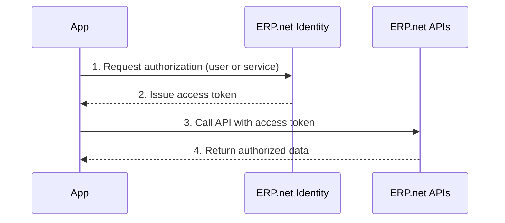

# Authentication and Authorization Overview

Apps that connect to @@name must authenticate securely and operate only within the permissions granted to them.

The authentication and authorization model in @@name ensures that every app and user is properly verified, identified, and restricted according to system policies.

This process is built on the **OAuth 2.0** standard and implemented through the **@@name Identity** and the **Trusted Applications** model.

## Why Authentication and Authorization Matter

Whenever an app interacts with an @@name instance, two questions must always be answered:

- **Who** is making the request - authentication
- **What** that entity is allowed to do - authorization

@@name enforces these principles through token-based access.  

Each app receives a secure, time-limited token that defines its identity and permissions.

This ensures that integrations remain safe, isolated, and fully auditable.

## The Building Blocks

Authentication in @@name is organized around three core components:

### ERP.net Identity

Each @@name instance includes a built-in **Identity** that manages all authentication and token issuance.  

It validates credentials, issues tokens, and applies the access rules configured in the instance.

### OAuth 2.0

@@name follows the **OAuth 2.0** framework for secure, standardized communication between applications and APIs.

OAuth 2.0 defines how apps request, use, and renew tokens without ever exposing user credentials.

### Trusted Applications

Before an app can connect, it must be registered as a **Trusted Application** within the target @@name instance.

This registration defines the app's identity, allowed flows, and permissions, forming a trusted relationship between the app and the instance.

## How It Works

At a high level, authentication in @@name follows this process:

1. The app is registered as a **Trusted Application** in the target instance.
2. The app requests access through the **@@name Identity**, either on behalf of a user or as a background service.
3. @@name Identity validates the request and issues an **access token**.
4. The app uses that token to call the APIs within the scope of its granted permissions.

## Types of Access

@@name supports two main types of access depending on how the app operates:

### Interactive access

The app represents a user and requires sign-in through a browser or web view.  

Used by web or mobile applications.  

Implements the [Authorization Code Flow](https://oauth.net/2/grant-types/authorization-code/) defined by [OAuth 2.0](https://oauth.net/2/).

### Service access

The app acts as a background service without user interaction.

Used by automations, integrations, or scheduled tasks.

Implements the [Client Credentials Flow](https://oauth.net/2/grant-types/client-credentials/) defined by [OAuth 2.0](https://oauth.net/2/).

Both types rely on the same **@@name Identity** and token-based authorization model.

## The Result of Successful Authentication

Once authentication and authorization complete successfully:

- The app or user gains a **secure session** within the @@name instance
- An **access token** is issued to represent that session
- Access is limited to the **scopes and permissions** granted
- All activity can be traced back to the app and its associated user or service identity

---

## Learn More

- [**How Apps Connect**](./concepts/how-apps-connect/overview.md)  
  Understand how the @@name Identity, OAuth 2.0, and Trusted Applications work together.

- [**Auth Flows**](./concepts/flows/overview.md)  
  Learn about the available OAuth 2.0 flows for different app types.

- [**Tokens**](./concepts/tokens/tokens-overview.md)  
  Understand access tokens, scopes, and permissions.

- [**Sessions**](./concepts/sessions/overview.md)  
  Learn how tokens map to sessions and license slots within @@name.
