# Authentication and Authorization – The Short Version

## TL;DR

Every app that connects to @@name must first be **trusted**, then **authenticated**, and finally **authorized** to act within the system.

Here's how it always works:

1. The app is **registered as a Trusted Application** in the target @@name instance.  
2. It authenticates through the **Identity Server**, which verifies who (or what) is signing in.  
3. The server issues an **access token** that defines what the app can do.  
4. The app uses that token to call **@@name APIs** securely and efficiently.  

All tokens are issued and verified by the instance's **Identity Server** - no passwords are exchanged and no direct database access is needed.

That's the foundation of secure, auditable, and consistent access across all @@name integrations.

## A Real-World Example

**Alice** manages operations at a distribution company powered by @@name.  

Her developer **Bob** creates a web app to help sales reps update orders in real time.

Here's what happens under the hood:

1. Bob registers the app as a **Trusted Application** in the company's @@name instance.  
2. When a sales rep logs in, the app redirects them to the **Identity Server** - the official login portal.  
3. After authentication, the server issues a **token** saying:  
   _This user is verified, and the app may update sales orders._
4. The app uses that token when calling the **@@name APIs**, which check it for validity and scope before processing the request.

Every request is authenticated, authorized, and traceable - without exposing user passwords or credentials.

```mermaid
flowchart LR
  Alice([👩‍💼 Alice - User]) -->|Signs in| App[💻 Sales Portal App]
  App -->|Auth Request| IDP[🛡️ ERP.net Identity Server]
  IDP -->|Access Token| App
  App -->|API Calls with Token| API[🎛️ ERP.net APIs]
  API -->|Access Data| Data[(📊 ERP.net Data)]
```

**In short:**  

- Authentication proves _who_ is calling.  
- Authorization defines _what_ they can do.  
- Together, they keep @@name secure and integrations predictable.

---

## Learn More

- [**Autentication and Authorization Overview**](overview.md)  

- [**Identity Server**](./how-apps-connect/identity-server.md)  
  Learn how @@name authenticates users and apps.

- [**OAuth 2.0 Overview**](./how-apps-connect/oauth2-overview.md)  
  Understand tokens, scopes, and grants.

- [**Trusted Applications and Access Control**](./how-apps-connect/trusted-apps-access.md)  
  See how app registrations define permissions and modes.

- [**Authentication Flows Overview**](./flows/overview.md)  
  Compare Authorization Code, Client Credentials, and Hybrid flows.
