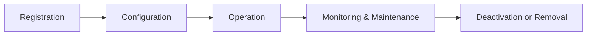

# Application Lifecycle

Every @@name App follows a lifecycle that describes how it is introduced, used, and eventually retired within an @@name instance.  

This model helps organizations keep integrations consistent, traceable, and secure over time.

## 1. Registration

Before an app can communicate with an @@name instance, it must be **registered** as a [Trusted Application](trusted-apps.md).  

This creates a formal relationship between the app and the instance, defining its identity and initial permissions.

Apps can be registered in several ways:

- **Manually**, by an administrator who creates a new Trusted Application entity
- **Automatically**, when installed from the [@@name Marketplace](https://marketplace.erp.net/)
- **Preconfigured**, as part of the core @@name platform for internal system apps

Registration is the first step that transforms an external piece of software into a managed part of the @@name environment.

## 2. Configuration

After registration, the app's configuration determines how it can interact with the instance.  

Administrators define details such as:

- Which operations or data areas the app may access (its scopes)  
- Whether it can act as a background service or only through user interaction (or both)
- Which user types (internal or external/community) it can represent
- Environment-specific settings

Configuration ensures that the app operates under clear, auditable rules that match the organization's policies.

## 3. Operation

Once configured and enabled, the app becomes an active part of the @@name ecosystem.

It interacts with the instance through its public APIs and operates within the permissions defined in its Trusted Application definition.

Apps may:

- Provide user-facing functionality such as web or mobile interfaces.
- Synchronize data between @@name and other systems.
- Run scheduled or automated background processes.

All interactions are governed by the same principles of trust and visibility that apply to every app within the instance.

## 4. Monitoring and Maintenance

Over time, apps may need review or adjustment to maintain security and stability.

Administrators can:

- Review usage and activity logs
- Update configuration or ownership details
- Rotate secrets or credentials
- Temporarily disable apps for maintenance

Regular maintenance ensures that integrations remain healthy and compliant with security requirements.

## 5. Deactivation or Removal

When an app is no longer needed, it can be **disabled** or **removed** from the instance.  

Disabling immediately stops access to APIs and data, while removal deletes the app's registration entirely.

This stage keeps the environment clean and ensures that only active, approved integrations remain trusted within the system.

## Lifecycle Summary

The lifecycle provides a clear, structured way to manage @@name Apps from creation to retirement - supporting transparency, control, and long-term reliability.

## Learn More

- [Trusted Applications](trusted-apps.md)  
  Understand how apps are identified and managed within an @@name instance.

- [Application Types](app-types.md)  
  Explore the different kinds of @@name applications.

- [Authentication and Authorization](../auth/overview.md)  
  See how apps connect securely to @@name through its built-in Identity Server.
