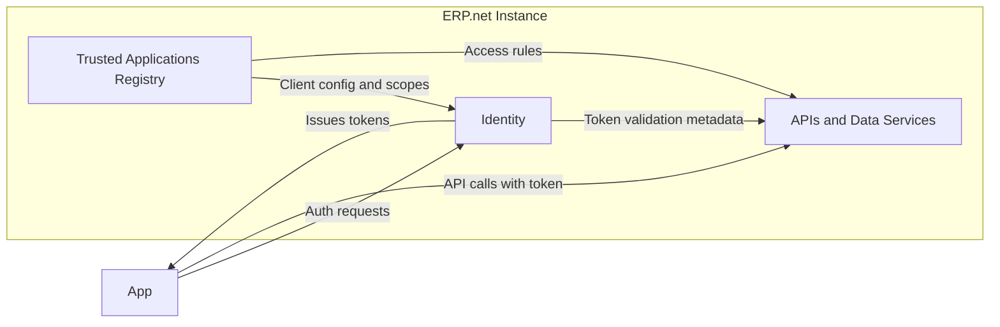

# How Apps Connect to @@name

Connecting an application to an @@name instance involves three key elements working together:

- **@@name Identity**, which authenticates users and services
- The **OAuth 2.0** framework, which defines how an app is delegated authorization and obtains access tokens from @@name Identity (the token's use and enforcement happen in the APIs).
- The **Trusted Application**, which defines and enforces each app's relationship with the instance

Together, they provide a consistent, secure, and auditable way for apps to communicate with @@name APIs.

## The Connection Model

Every app that interacts with @@name must first be registered as a **Trusted Application** in the target instance.  

This registration establishes a formal trust relationship and defines how the app can authenticate and what data it can access.

When an app needs to connect:

1. It sends an **authorization request** to the instance's **@@name Identity**.  
2. @@name Identity validates the app's identity and credentials.  
3. If successful, it issues a **token** that represents the app or user session.  
4. The app uses this token to call the instance's APIs within its granted scopes.

## Core Components in Connection

### @@name Identity

**@@name Identity** is the authentication authority inside each @@name instance.  

It verifies identities, applies instance-level security policies, and issues OAuth 2.0 tokens used by apps and users.

See [@@name Identity](./identity-server.md) for more details.

### OAuth 2.0

**OAuth 2.0** defines the industry-standard flows used by @@name for obtaining and managing tokens.

It ensures that credentials are never shared directly between apps and services, while still allowing delegated access.

See [OAuth 2.0 in @@name](oauth2-overview.md) for an overview of how these flows work in practice.

### Trusted Applications

A **Trusted Application** defines how a specific app is recognized by an @@name instance - including its client type, authentication flows, and permissions.

See [Trusted Applications in Authentication](../../auth/configuration/trusted-apps-access.md) to learn more.

## Putting It All Together

When combined, these components form the connection lifecycle:

1. **Registration** - The app is registered as a Trusted Application.  
2. **Authentication** - The app (or user) authenticates via @@name Identity.  
3. **Authorization** - The server issues tokens defining what access is allowed.  
4. **API Interaction** - The app uses these tokens to call @@name APIs.  

Each step is tightly controlled by instance policies, ensuring that every request is authenticated, authorized, and fully traceable.

---

## Learn More

- [**@@name Identity**](identity-server.md)  
  Understand the built-in authentication authority in each @@name instance.

- [**OAuth 2.0**](oauth2-overview.md)  
  Learn how apps use OAuth 2.0 flows to obtain and manage tokens.

- [**Trusted Applications and Access Control**](../../auth/configuration/trusted-apps-access.md)  
  See how apps are registered and governed inside @@name.
