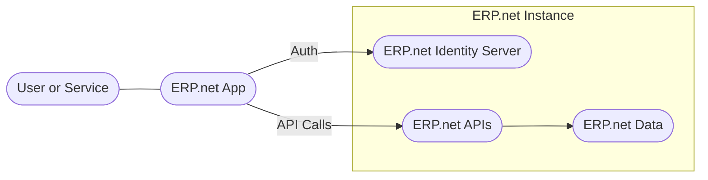

# Overview

@@name Apps allow developers to extend, integrate, and automate @@name systems using the @@name APIs.  

They make it possible to build new user experiences, connect @@name with other software, and streamline business processes.

Every app - whether internal, external, or marketplace - connects to @@name securely through its built-in **Identity Server** and is represented in the system by a **Trusted Application** entity.  

Together, these components ensure that every app is properly identified, authenticated, and authorized with appropriate access.

## What Are @@name Apps

An *@@name App* is any application, service, or integration that communicates with an @@name instance through its public APIs.  

Apps can range from small automation scripts to complete web or mobile solutions built around @@name data and business logic.

Examples of @@name Apps include:

- A web store that allows customers to browse products and place orders online
- A background integration that synchronizes stock levels with an online store
- A web portal that allows suppliers to update product information
- An analytics service that extracts and processes ERP data for reporting

Apps can be developed by in-house teams, partners, or independent developers and can operate in private environments or be distributed through the [@@name Marketplace](https://marketplace.erp.net/).

## Why Build Apps

Apps extend the value of @@name beyond its core modules.

They allow organizations to:

- Tailor @@name to their unique business workflows
- Integrate with external platforms and internal systems
- Automate routine operations and data flows
- Deliver focused experiences for specific users or roles

By connecting securely to an @@name instance, apps help organizations innovate without altering the base system.

## How Apps Work with an @@name Instance

Each app communicates with an @@name instance through standard APIs that are part of the instance itself.

Before it can do so, the app must be recognized and granted the right level of access.

This is handled by two core components of the platform:

- The **Identity Server**, which authenticates users and services and enforces authorization decisions based on instance policies
- The **Trusted Application**, which represents the app's registration and configuration inside the instance

When an app needs to access data, it initiates authentication with the Identity Server (either interactively through a user or non-interactively as a service).

After successful authentication and authorization, the app calls the APIs within the instance to read or update @@name data in line with its allowed permissions.

## Apps as Part of the @@name Platform

@@name treats every app as a managed, auditable part of the system.

Administrators can see which apps are trusted, what they are authorized to access, and how they interact with the instance.

They can also revoke or adjust access at any time, maintaining full control over integrations.

This model allows @@name Apps to be open, extensible, and secure - forming a flexible ecosystem where developers can build new solutions without compromising platform integrity.

## Learn More

- **[What Are @@name Apps](what-are-erpnet-apps.md)**  
  Understand what @@name Apps are and how they connect to an ERP.net instance.

- **[Application Types](app-types.md)**  
  Explore the different kinds of @@name Apps - internal, external, and marketplace.

- **[Trusted Applications](trusted-apps.md)**  
  Learn how each app is registered, managed, and granted access within @@name.

- **[Authentication and Authorization](../auth/overview.md)**  
  See how the built-in Identity Server authenticates and authorizes apps and users.