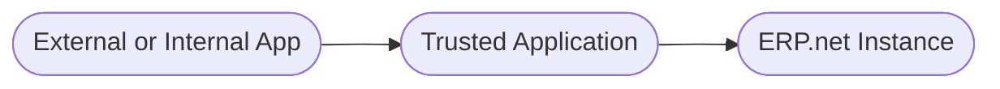

# Trusted Applications

A **Trusted Application** in @@name defines the relationship between an app and a specific @@name instance.  

It represents a registered entity within that instance that identifies the app and governs how it is allowed to interact with the system's APIs and data.

Every app that connects to @@name has a corresponding Trusted Application entity that represents its identity inside the instance.

## What a Trusted Application Represents

A Trusted Application acts as a bridge between the @@name platform and external or internal software.  

It defines:

- **Who the app is** – its unique identifier within the instance  
- **What the app can access** – its defined permissions and scope  
- **How the instance treats it** – whether it is active, internal, or external  
- **Who manages it** – administrators who control its configuration and lifecycle  

This ensures that all connected apps are intentional, identifiable, and controlled.

Every integration or API call can be traced back to a known, trusted app identity.

## Why Trusted Applications Exist

Trusted Applications provide a secure and maintainable way to manage how different apps connect to @@name.  

They prevent unregistered or unauthorized systems from accessing data and give administrators full visibility and control over integrations.

Key benefits include:

- Centralized control over app access and configuration  
- Clear separation between @@name's internal components and external software  
- Flexibility to enable or disable integrations at any time  
- Transparency and auditability for all connected apps  

## Key Concepts

Each Trusted Application entity contains essential information that defines its relationship with the @@name instance:

| Concept | Description |
|----------|--------------|
| **Name** | A human-readable identifier for administrators and users. |
| **Application URI** | A unique identifier for the app (for example, `com.company.myapp`). |
| **Client Type** | Describes whether the app can securely handle sensitive information (public or confidential). |
| **Scopes** | Define which parts of the @@name environment the app is allowed to access. |
| **System User** | An optional user account associated with background or automated apps. |
| **Status (Enabled/Disabled)** | Controls whether the app is currently allowed to connect. |

Together, these attributes define how @@name recognizes and governs each app that communicates with it.

> [!NOTE]
> The attributes listed above represent only a subset of all available fields.  
> They are included here to illustrate how a Trusted Application defines and governs communication between an app and the instance.

## How Trusted Applications Are Created

Trusted Applications can appear in an instance in several ways:

- **Manually created** by an administrator when setting up a new integration  
- **Automatically registered** when an app is installed from the [@@name Marketplace](https://marketplace.erp.net/)  
- **Preconfigured** for internal apps that are part of the @@name platform  

Once registered, the Trusted Application becomes the system's reference point for managing and auditing that app's activity.

## Lifecycle of a Trusted Application

Trusted Applications follow a simple lifecycle:

1. **Registration** – The app is added to the instance and assigned its identifiers.  
2. **Configuration** – Administrators define its type, permissions, and allowed operations.  
3. **Use** – The app interacts with @@name data through the defined APIs.  
4. **Review** – Activity can be monitored and adjusted as needed.  
5. **Revocation** – Access can be disabled or removed at any time.  

This process ensures that each app's access remains secure, visible, and manageable throughout its lifecycle.

## Relationship to Apps and the @@name Instance

A Trusted Application connects the worlds of external software and the @@name platform.

It does not execute any code itself; instead, it defines how an app is trusted to interact with the instance.

---

## Learn More

- **[What Are @@name Apps](what-are-erpnet-apps.md)**  
  Learn how apps extend and integrate with @@name.

- **[Application Types](app-types.md)**  
  Explore the different kinds of @@name applications.

- **[Authentication and Authorization](../auth/overview.md)**  
  See how apps authenticate and obtain permissions through @@name's Identity Server.
