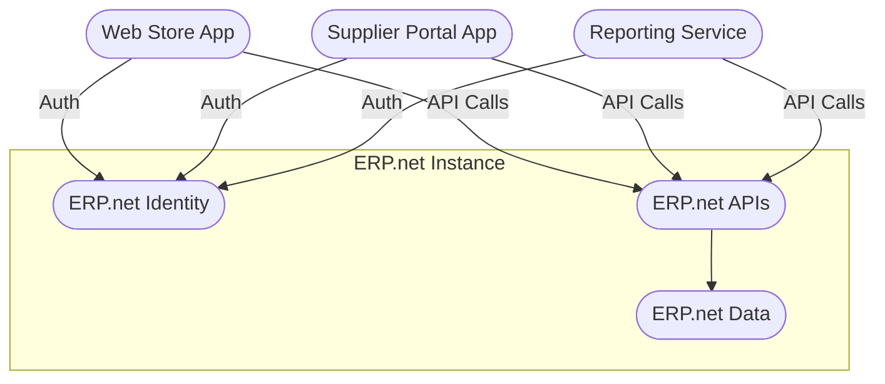

# What Are @@name Apps

An *@@name App* is any application, integration, or service that connects to an @@name instance to extend, customize, or interact with its business data and functionality.

@@name Apps are the foundation of the @@name ecosystem.

They allow organizations, partners, and developers to create additional capabilities without modifying the core @@name platform.

## Definition and Purpose

@@name Apps are external or internal software components that communicate with an @@name instance through its public APIs.

Each app performs a defined business or integration purpose, such as synchronizing data, automating a process, or providing a dedicated user interface.

An app:

- Operates outside of the @@name instance, but connects to it securely
- Uses the standard @@name APIs that are part of every instance
- Is recognized by the system through a **Trusted Application** entity
- Authenticates and authorizes through the built-in **@@name Identity**

Apps are used by businesses to adapt @@name to their specific needs, integrate it with other systems, or deliver tailored digital experiences.

## Key Characteristics

| Aspect | Description |
|--------|--------------|
| **Ownership** | Apps can be developed and managed by a tenant, a partner, or published to the @@name Marketplace. |
| **Access** | Each app must be registered as a Trusted Application in the @@name instance to be recognized and authorized. |
| **Interaction** | Apps communicate with the instance using APIs that are part of the @@name platform. |
| **Security** | Access control and authentication are handled by the built-in @@name Identity and system policies. |
| **Deployment** | Apps can run anywhere - on-premises, in the cloud, or embedded in another service. |
| **Lifespan** | Apps can be enabled, disabled, or updated at any time without affecting the instance core. |

## How Apps Fit into the @@name Platform

Every @@name instance can connect with multiple apps.

Each app acts as an independent client that requests access to the instance, performs operations through APIs, and obeys the platform's access and auditing policies.

Conceptually:

Each app:

- Authenticates through @@name Identity inside the instance
- Uses APIs that are part of the same instance
- Reads or writes data according to its granted permissions

## App Lifecycle (High-Level)

1. Design - define the app's purpose and functionality.
2. Register - create a Trusted Application entity in the @@name instance.
3. Develop - implement logic that connects to the @@name APIs.
4. Test - connect to a sandbox or test environment to validate functionality.
5. Deploy - make the app available to users or customers.
6. Maintain - update scopes, manage credentials, and monitor usage.

This lifecycle applies equally to internal tools, partner integrations, and marketplace apps.

---

## Learn More

- **[Application Types](app-types.md)**  
  Learn about the different kinds of @@name Apps - internal, external, and marketplace.

- **[Trusted Applications](trusted-apps.md)**  
  Understand how each app is registered and recognized by the ERP.net instance.

- **[Authentication and Authorization](../auth/overview.md)**  
  See how the built-in @@name Identity authenticates and authorizes apps and users.
  