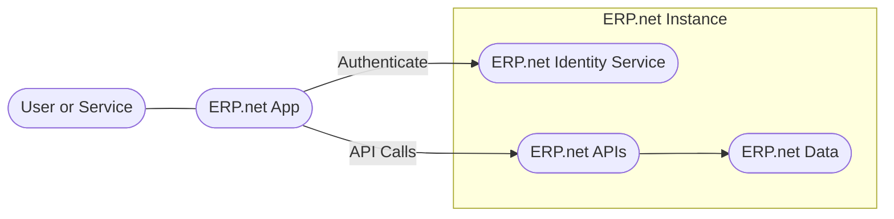

# Building Apps Overview

This section describes how applications integrate with @@name at a platform level.

Any software that connects to an @@name instance through its public APIs is treated by the platform as an **@@name App**. Apps are external to the core ERP and interact with it through well-defined boundaries.

## What an @@name App Is

In @@name, an app is not a specific product or framework.  
It is a role assigned to any application that communicates with an instance through APIs.

Apps may be implemented as:

- User-facing applications
- Background or service-based integrations
- Automation or synchronization components
- Reporting and analytics solutions

Apps can operate internally, connect external systems, or be distributed through the @@name Marketplace.

Different app designs are formalized as **application types**, which are described in more detail in [Application Types](./concepts/app-types.md).

## Where Apps Run

Each @@name database is an **instance**.

Apps always connect to a specific instance and are subject to that instance's configuration, data scope, and access rules. 

For details, see [@@name Instances](./concepts/erp-instances.md).

## How Apps Are Identified and Controlled

Apps do not access an instance implicitly.

Each app is explicitly registered inside the instance and represented as a **Trusted Application**. This registration defines how the app is identified and what level of access it is granted.

Authentication and authorization are enforced by the @@name Identity Service and apply uniformly across all APIs.

Authentication, authorization, and related concepts are covered in detail in [Authentication and Authorization](../auth/overview.md).

## How Apps Interact with the Platform

@@name exposes APIs that apps use to interact with data and functionality within an instance.

Different APIs are designed for different integration scenarios, such as application development or high-volume data access. The available API surface and access model depend on the app's design and intended use.

Guidance on selecting the appropriate API is provided in [Choosing the right API](./getting-started/choose-right-api.md).

## High-Level Interaction Model

This model applies to all @@name Apps, regardless of implementation or deployment style.

## How to Proceed

If you are ready to build an app, continue with [Getting Started](./getting-started/overview.md).

That section walks through the initial setup, app registration, and making your first API calls.
