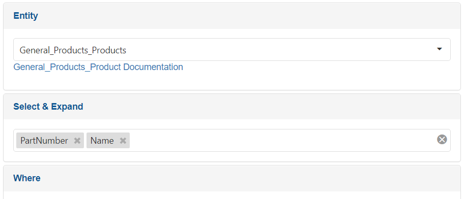

# Welcome to the ERP.net Developer Documentation

Here you will find all the necessary resources for building applications targeting the ERP.net services.

This documentation contains developer resources. For business logic and other technical documentation, you might want to check the [Technical Documentation](https://docs.erp.net/tech).

## ERP Instances

The ERP.net service is a hosted ERP service.
Accessing the data is done through ERP Instances.
When you sign up at [erp.net](https://erp.net), you can create and manage a new ERP Instance.

An ERP Instance is a tenant in the hosting environment.
It is multi-company, e.g. it allows managing multiple related legal entities (companies) in one instance.
You don't need to create separate instances for each managed company.

Each ERP Instance has a unique name.
The instance can be accessed at:
https://<<instance_name>>.my.erp.net

For example, the demonstration database, DEMODB, is located at:

> <https://demodb.my.erp.net>

## The API

Each ERP Instance CAN have an API site.
It "can" have, because, the API is a site, similar to other sites, which the instance can launch.
In order for the API to function, it needs to be configured and launched for the ERP Instance.

The common URL for the API site is /api/ inside the ERP instance. For example, the DEMODB has API site at:

> <https://demodb.my.erp.net/api/>

## The Domain API

The Domain API is the primary means for accessing and manipulating data in the ERP Instance.
It can currently be consumed in [OData 4](https://www.odata.org/) format.

The Domain API is an API proxy for the object-oriented Domain Model of ERP.net.
It is targeted towards UI and service apps. These kind of apps usually read and update moderate amounts of data.
The Domain API is NOT adequate for read-only dumping of very large amounts of data, which is usually done by BI applications.
BI applications should find other solutions or try to read data by small chunks.

The Domain API is located at /domain/odata/ within the API site. For DEMODB, this is at:

> [https://demodb.my.erp.net/api/domain/odata/](https://demodb.my.erp.net/api/domain/odata/)

> [!TIP]
> **User:** Admin
>
> **Password:** 123

If you try the above link, it will ask you for user credentials.
Most ERP Instances should, by default, be configured to NOT accept basic authentication.
However, for demonstration purposes, DEMODB is configured to allow it.

## Sample Query

OData v4 allows the creation of URL-based queries.
For example, to take the first 10 products (in undefined order), you can use:

> [<https://demodb.my.erp.net/api/domain/odata/General_Products_Products?$top=10>](https://demodb.my.erp.net/api/domain/odata/General_Products_Products?$top=10)

NOTE: The above will return unformatted JSON result, intended to be consumed by client app.

For a quick overview of OData, see this topic - [Understand OData in 6 steps](https://www.odata.org/getting-started/understand-odata-in-6-steps/).

## The Query Builder

@@name has integrated visual Query Builder.

The Query Builder allows building queries, specific to the ERP Instance.
When you use the Query Builder, it allows you to select the user-defined data and calculated attributes in that instance.

The Query Builder allows the developers to create the query visually and then just re-use the query text, replacing the parameters.

To access the Query Builder for DEMODB, go to:

> [https://demodb.my.erp.net/api/domain/querybuilder](https://demodb.my.erp.net/api/domain/querybuilder)

While the query is built, the Query Builder changes its URL.
For example, to preview the same query for the first 10 products in the Query Builder, head to:

> [<https://demodb.my.erp.net/api/domain/querybuilder#General_Products_Products?$top=10>](https://demodb.my.erp.net/api/domain/querybuilder#General_Products_Products?$top=10)

When you press Execute in the Query Builder, you can preview the result both as table and as JSON.

NOTE: Pay attention to the link under the selected entity, which opens the documentation for the entity.

## The Query Tool

The Query Tool is simple Postman-like tool for querying the database.
It does not have the visual building abilities of the Query Builder.
However, it can represent all possible REST requests and is very simple to use.

> [!NOTE]
> The Query Tool is the default tool, which is used to represent queries in forum posts, tickets, etc.

To access the Query Tool for DEMODB, go to:

> [https://demodb.my.erp.net/api/domain/query](https://demodb.my.erp.net/api/domain/query)

## Query Basics

ERP.net allows only a subset of the full OData queries.
Generally, you cannot do JOINs, and filter with OR.
However, you can filter by multiple values, like the SQL IN operator:

> <https://demodb.my.erp.net/api/domain/odata/General_Products_Products?$top=10&$filter=Id%20in%20(edf2bd2a-7e4d-e111-a06c-00155d00050a,cf728601-1fd5-4853-ab23-01deeee7d038)>

## Instance API Reference

Each ERP Instance has its own API reference documentation.
The instance-specific API reference documentation is like the [Model](https://docs.erp.net/model) docs.
The main difference is that the reference documentation of a specific ERP Instance lists also the user-defined attributes.
The user-defined attributes can be queried mostly like the system attributes.

The instance reference documentation of DEMODB is at:

> [https://demodb.my.erp.net/api/domain/docs](https://demodb.my.erp.net/api/domain/docs)

> [!TIP]
> Since the instance API reference contains user-defined objects from the database, it is accessible only after authentication.
> For general-purpose information, check the [Model](https://docs.erp.net/model).

## Security

Someone said: "Security is hard, deal with it".
The hard truth is that security today is much harder that it was 10 years ago.
Once upon a time, there was a user and a password.
Today, we have OAuth with Trusted Apps, Security Tokens, complicated security workflows, and all the other things.
There are some good things, though.
Single Sign-On, multi-factor authentication, and other extras come to mind.

But, at the end of the day, you have to do much more work to create a secure app.

ERP.net is based on the [OAuth 2](https://oauth.net/2/) security paradigm with [OpenID Connect](https://openid.net/connect/) support.

For more information about security, read [Introduction to authentication in ERP.net](topics/authentication/index.md).

## Next Steps

See the general topics in [General](topics/index.md).

Check the [Domain API documentation](domain-api/index.md).

Check the [Domain Model](https://docs.erp.net/model) for reference information about objects, API methods, integrated business rules and more.
