# Table API

The primary purpose of the Table API is to allow external BI (Business Intelligence) tools to quickly pull raw data for further analysis.

## Authentication

The Table API supports the following types of authentication:
* OAuth 2.0
* Basic Authentication

> [!CAUTION]
> Although Basic Authentication is supported, its use is strongly **NOT** recommended due to its significantly lower level of security.

For more information, see [Authentication](../authentication/index.md).

## Tables

For information about the tables that can be queried, see the [Table Model](https://docs.erp.net/model/tables/).

## Best practices for refreshing data when building external BI systems based on a TableAPI site

### Introduction

The first step in building a BI system is loading (Extract) data from the source database. This is done using a TableAPI site that allows an authorized user to access raw data at the table level. It is essential to achieve optimal transfer speed by using the capabilities provided for filtering the primary information to minimize data refresh time.

For this reason, we describe best practices when using TableAPI (OData) data source to power PowerBI and BI data analysis platforms in general. The information is organized with increasing complexity and presented through examples for ease of understanding, allowing for step-by-step code copying and testing. Following these guidelines is necessary to avoid potential errors and delays when loading data.

There are two main ways to download data:

1. **Using OData.Feed to read data from the source**
2. **Using Web.Contents to read data from the source**
   
In both approaches, you must manually set parameters and filters for queries to achieve optimal results. This includes specifying the fields returned by the query (listed in the select clause) and setting the filter that will be applied to determine the data.

Filters can be applied either on fields of the table that will be loaded, or on related tables at a higher level in the hierarchical model. This means that a table containing document rows can be filtered by fields in the document head (e.g., filtering by **Document_Date**), which will enable incremental refreshing of data.

Both options use authentication via **Basic identification** (username and password). These access authorization parameters must be entered in both PowerBI Desktop and the PowerBI model published online.

For a small database, it may be possible to skip the presets described below. However, as databases grow, BI models extend, and service configurations change, it becomes imperative to define initial parameters to be used throughout the entire BI project.

### Pre-defining and setting important common parameters

The main parameters required for work are:

- **RangeStart** - System mandatory parameter when using incremental refresh, setting the start time for a subperiod
- **RangeEnd** - System required parameter when using incremental refresh, setting the end time for a subperiod
- **TopCount** - User parameter to facilitate project editing, containing the number of records to download
- **baseURL** - User parameter specifying a site (TableAPI) from which data is downloaded

The **RangeStart** and **RangeEnd** parameters are of type **Date/Time** and must have values set so that preview data can be loaded when working with the model in PowerBI Desktop.

The **TopCount** parameter is of type **Decimal number** and sets the number of records to be fetched with a single query. In the PowerBI Desktop development environment, this should be a relatively small value, such as **500**, so that preview data can be loaded quickly.

The **baseURL** parameter is of type **Text** and contains the address of the TableAPI site. It's good to define it this way because it can be easily changed from one location in the entire project should any change occur.

For example, it could have the following value: 

**"https://test-tableAPI.erp.net"**

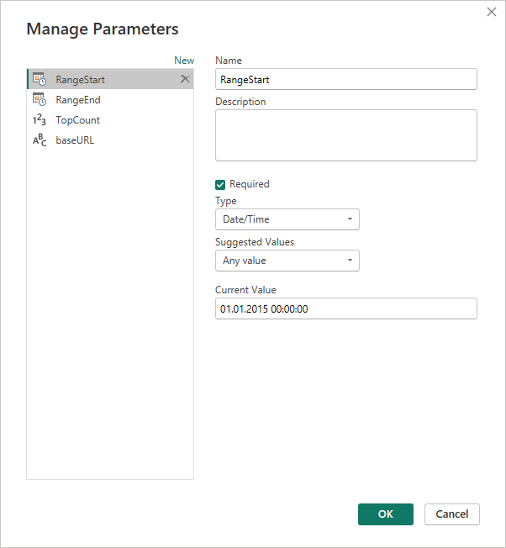 <br> _Picture 1_ <br>

### Loading model information

Select "**OData feed**" from the menu using the "**New source**" button.

Fill in the data as shown in the picture (assuming we have defined the **baseURL** parameter as shown above).

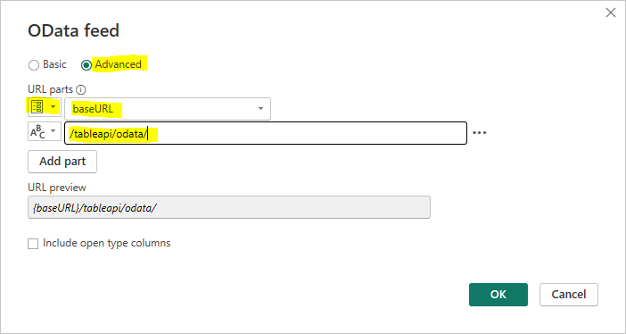<br> _Picture 2_ <br>

The available objects data will be loaded, allowing you to see what each one looks like. This is necessary to determine the field names you'll need to filter by or use when filtering by a reference field.

The following picture shows what the **Crm_Sales_Orders** object looks like, particularly the field used to reference the document head needed for filtering (the **Document_Reference** field).

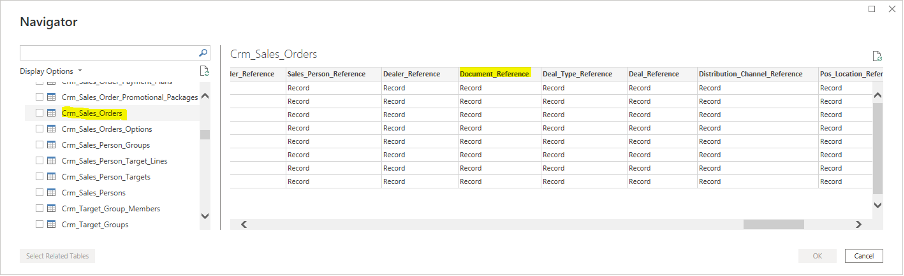<br> _Picture 3_ <br>

You can choose to load data directly this way, as it supports additional filtering by fields in the table and selecting which fields to load. This method **does NOT SUPPORT** **filtering by reference fields and is therefore not applicable if incremental refresh is to be used!**

### Loading data via OData.Feed reading from source

This method is suitable for testing **only in PowerBI Desktop** because it is **NOT SUPPORTED** **by online PowerBI**. It is described here as it provides basic insights into understanding and working with TableAPI queries.

Some of the steps described below are also applicable to other data sources. 

General guidelines for operation are provided through the following points:

1. Set the data source for each Query that uses TableAPI in the first step (Source) as follows:

   ```
   = OData.Feed(baseURL & "/tableapi/odata/{Table_Name}{Parameters}", null, [Implementation="2.0"])
   ```
         
   - **{Table_Name}** - replaced with the name of the table to be loaded, e.g., **Gen_Documents**
   - **{Parameters}** - replaced with OPTIONAL parameters to the query
   
   If access authorization is not set yet, you must select one with **Basic** type and specify the values of the "**User name**" and "**Password**" parameters for the user who has access to the TableAPI application.
   
   The parameter section (if present) must begin with a "?" symbol. Parameters are separated from one other by the "&" symbol.
   
   Possible parameters are:
   
   - "**$filter=**" - Specifies the conditions that the returned data will meet
   - "**$select=**" - Sets the fields to be returned by the query
   - "**$top=**" - Sets the maximum number of records to return from the query

2. Use permanent filtering.

   Add the appropriate filter in the URL using the options supported by TableAPI.
   
   An example of filtering table **Gen_Document** by active (Void=false) and released (State>=30) documents:
   
   ```
   let
      Source = OData.Feed(baseURL & "/tableapi/odata/Gen_Documents?$filter=Void eq false and State ge 30", null, [Implementation="2.0"])
   in
      Source
   ```
   
   To get this step code, you can add the following in the OData source URL (in addition to the one shown in picture 2):
   
   ```
   /tableapi/odata/Gen_Documents?$filter=Void eq false and State ge 30
   ```

3. Add filtering by fields with listed values.

   To the above example, you also need to add filtering by Entity_Name for values 'Inv_Transactions' and 'Crm_Sales_Orders':
   
   ```
   =OData.Feed(baseURL & "/tableapi/odata/Gen_Documents?$filter=Void eq false and State ge 30 and Entity_Name in ('Inv_Transactions','Crm_Sales_Orders')", null, [Implementation="2.0"])
   ```
   
   Note that TableAPI supports filtering by enumerated values, and this can be done directly from the PowerBI Desktop interface.
   
   Here is what the query generated by PowerBI Desktop looks like before adding the filtering:
   
   ```
   HTTP GET /tableapi/odata/Gen_Documents?$filter=Void eq false and State ge 30&$top=1000
   ```
   
   This happens if the Void and State filterings for **Gen_Documents**, as well as **Gen_Documents**, are selected entirely through the interface. The steps generated in this process can be viewed in the **Advanced editor**:
   
   ```
   let
       Source = OData.Feed(baseURL & "/tableapi/odata/", null, [Implementation="2.0"]),
       Gen_Documents_table = Source{[Name="Gen_Documents",Signature="table"]}[Data],
       #"Filtered Rows" = Table.SelectRows(Gen_Documents_table, each([Void] = false)),
       #"Filtered Rows1" = Table.SelectRows(#"Filtered Rows", each [State] >= 30)
   in
       #"Filtered Rows1"
   ```
       
   Through the interface, we can also add **Entity_Name** filtering as shown in the following picture:
   
   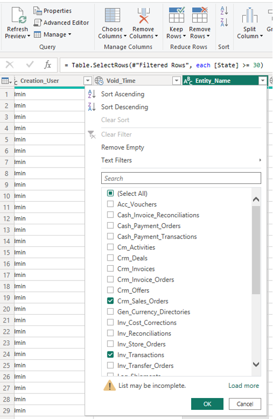<br> _Picture 4_ <br>
   
   This will trigger the creation of the next step with code:
   
   ```
   = Table.SelectRows(#"Filtered Rows1", each([Entity_Name] = "Crm_Sales_Orders" or [Entity_Name] = "Inv_Transactions"))
   ```
   
   The following query will be executed to the data source, where the addition from this filtering is shown:
   
   ```
   HTTP GET /tableapi/data/Gen_Documents?$filter=Void eq false and State ge 30 and (Entity_Name eq 'Crm_Sales_Orders' or Entity_Name eq 'Inv_Transactions')&$top=1000
   ```
   
   This example shows the support in the TableAPI filter construct: 
   
   ```
   and (Field_Name eq 'Value1' or Field_Name eq 'Value2' ... or Field_Name eq 'ValueN')
   ```
   
   Everything described in this section can be used for nomenclatures that will be fully loaded or do not need filtering by reference fields.

4. Filtering by date type fields.

   As an example, we will use the **Document_Date** field to select documents only from the first 6 months of the year:
   
   ```
   =OData.Feed(baseURL & "/tableapi/odata/Gen_Documents?$filter=Void eq false and State ge 30 and Document_Date ge 2023-01-01T00:00:00Z and Document_Date le 2023-06-30T00:00:00Z", null, [Implementation="2.0"])
   ```
   
   Note the date format '**YYYY-MM-DDThh:mm:ssZ**' and respect it when using dates.

5. Filter by referenced fields (fields from related tables that are not present in the current table).

   An example of such a query is filtering records from the **Inv_Transactions** table by taking only those for active (Void=false) and released (State>=30) documents:
   
   ```
   =OData.Feed(baseURL & "/tableapi/odata/Inv_Transactions?$filter=Document_Reference/Void eq false and Document_Reference/State ge 30", null, [Implementation="2.0"])
   ```
   
   This filtering is similar to the one in step 2, the only difference being a reference to the field by which we will filter. You can define the names of the fields pointing to reference tables as shown in picture 3. In order to support filtering by reference, this needs to be explicitly documented in the **Table model** documentation.

6. Filter by fields from tables present in the Owner Tables Hierarchy list.
   
   **Filtering by fields for tables present in the Owner Tables Hierarchy list described in the Table model documentation is always supported!**
   
   Additionally, you can filter on a field that is not in a directly related table (located more than one level away in the hierarchy).
   
   For example, if we want to filter **Inv_Transaction_Lines** by a date of the document in which the rows are included (**Document_Date** field of **Gen_Documents**), we must pass through two consecutive references as shown in the example:
   
   ```
   =OData.Feed(baseURL & "/tableapi/odata/Inv_Transaction_Lines?$filter=Transaction_Reference/Document_Date ge 2023-01-01T00:00:00Z and Transaction_Reference/Document_Reference/Document_Date le 2023-01-31T23:59:59Z", null, [Implementation="2.0"])
   ```
   
   This is due to the hierarchical relationship between the tables, which follows a certain connectivity scheme (**Field(Table)** format):

   ```
   Transaction_Reference(Inv_Transaction_Lines) -> Transaction_Id(Inv_Transactions)
   Document_Reference(Inv_Transactions) -> Id(Gen_Documents)
   ```

7. Filter data by the date of the document in which it is included.

   Using OData feed **does NOT allow incremental refresh of data**. The example below uses **Web.Contents** as a way to fetch data:
   
   ```
   =Json.Document(Web.Contents(baseURL & "/tableapi/odata/Inv_Transaction_Lines",[Query=[#"$filter" = "Transaction_Reference/Document_Reference/Document_Date ge " & DateTime.ToText(RangeStart,[Format="yyyy-MM-dd'T'HH:mm:ss'Z'", Culture="en-US"]) & " and Transaction_Reference/Document_Reference/Document_Date le " & DateTime.ToText(Date.EndOfDay(Date.AddDays(RangeEnd,-1)),[Format="yyyy-MM-dd'T'HH:mm:ss'Z'", Culture="en-US"])]], 65001)
   ```
   
   Since a comparison using 'le' (operator <=) must be used, the following statement calculates the correct end date of the period:
   
   ```
   Date.EndOfDay(Date.AddDays(RangeEnd,-1))
   ```

> [!IMPORTANT]
> In the filter, you can use only: <br>
> - The logical operator '**and**'
> - The comparison operators '**eq**', '**le**', '**ge**'
> - The operator '**like**'
> - The comparison operator with list of values '**in**' <br>
> 
> If a logical **OR** operator is needed in the filter, the query must be split into several separate queries that do not contain OR, which are then combined into a single query using "**Append queries**". <br>
> An exception is the above-described statement for filtering by enumerated values of the type:
> 
>     **and (Field eq 'Value1' or Field eq 'Value2' ... or Field eq 'ValueN')** <br>
> 
> which is equivalent to the standard supported statement: <br>
> 
>     **and Field in ('Value1', 'Value2', ...,'ValueN')** <br>

In PowerBI, it is possible to set up **incremental updating**. 

For this purpose, you must create two parameters (**RangeStart**, **RangeEnd**) of type **DateTime** whose values automatically change according to the incremental updating policy set for the specific object in PowerBI. Here, it is necessary to manually modify the query after the initial URL is set, because there is no way to add the information from the input parameters formatted in the desired way.

### Using incremental refresh to accelerate data updates in PowerBI

To achieve filtering for lines and other tables by the **Document_Date** field of the document head, it is necessary to filter by a reference field. However, an incremental refresh problem will then arise. It is not possible to set the required filtering without manually setting parameters by which to filter, and PowerBI online does not support refreshing from the source that was set this way.

**It is imperative that you set the general parameters described at the beginning of this article before proceeding!**

#### Data loading via Web Content with the ability to filter by reference fields and compatibility with incremental refresh

Let's apply the following approach:

1. Use Web Content as data source
2. Manually set all possible filters that should be applied in the data source to reduce the transferred data as much as possible
3. Manually set the list of fields to be returned to reduce the amount of data
4. Convert the returned data to JSON
5. Convert the result to a table, after which other processings can continue
   
It is easiest to use the example provided, which can be changed as needed.

An example of data filtering for table **Crm_Sales_Order_Lines_Table**:

```
let
    strEntity = "Crm_Sales_Order_Lines",
    strEntityHeadReference = "Sales_Order_Reference",
    strSelectFields = "",
    strEntHead = strEntityHeadReference & (if strEntityHeadReference = "" then "" else "/"),
    strDocHead = strEntHead & "Document_Reference/",
    strFilter = strDocHead &"Void eq false and " & strDocHead & "State ge 30 and " & strDocHead & "Document_Date ge " & strRangeStart &" and " & strDocHead & "Document_Date le "& strRangeEnd,
    strRangeStart = DateTime.ToText(DateTime.From(RangeStart),[Format="yyyy-MM-dd'T'HH:mm:ss'Z'", Culture="en-US"]),
    strRangeEnd = DateTime.ToText(Date.AddDays(DateTime.From(RangeEnd),-1),[Format="yyyy-MM-dd'T'HH:mm:ss'Z'", Culture="en-US"]),
    Source1 = Json.Document(Web.Contents(baseURL & "/tableapi/odata/" & strEntity, 
    [Query=[#"$filter" = strFilter, #"$select" = strSelectFields, #"$top" = Text.From(TopCount)], Timeout=#duration(0, 2, 0, 0)]), 65001),
    ResultList = Source1[value],
    value = if List.NonNullCount(ResultList) = 0 then List.Union({ResultList, {null}}) else ResultList,
    #"Converted to Table" = Table.FromList(value, Splitter.SplitByNothing(), null, null, ExtraValues.Error),
    #"Result" = Table.ExpandRecordColumn(#"Converted to Table", "Column1", {"Sales_Order_Id", "Line_No", "Product_Id", "Quantity", "Quantity_Unit_Id", "Product_Price_Id", "Unit_Price", "Line_Discount_Id", "Line_Standard_Discount_Percent", "Line_Custom_Discount_Percent", "Line_Amount", "Line_Store_Id", "Requested_Quantity", "Quantity_Base"}, {"Sales_Order_Id", "Line_No", "Product_Id", "Quantity", "Quantity_Unit_Id", "Product_Price_Id", "Unit_Price", "Line_Discount_Id", "Line_Standard_Discount_Percent", "Line_Custom_Discount_Percent", "Line_Amount", "Line_Store_Id", "Requested_Quantity", "Quantity_Base"})
in
    #"Result"
```

### Add new table with incremental refresh capability (step-by-step)

1. Switch to edit data sources mode (select from **Home -> Queries -> Transform data**).

2. Create a new query (table) from **Home -> New Source -> Blank Query**.

   Then, navigate to **Home -> Query -> Advanced editor** to open the window in which the M code of the query is written.
   
   The result is as follows:
   
   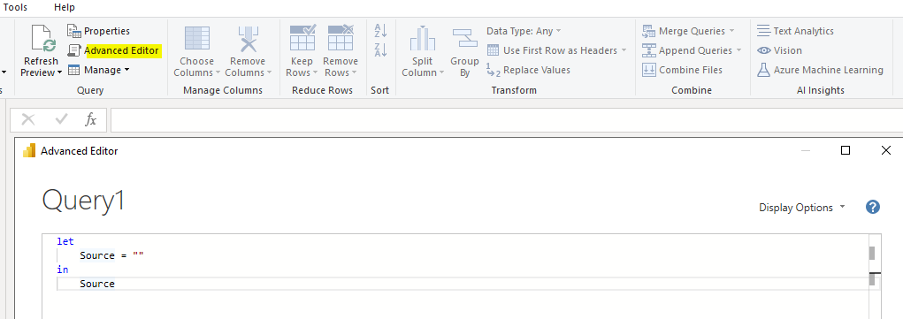<br> _Picture 5_ <br>

3. Replace the text in the window with the above sample text (for **Crm_Sales_Order_Lines_Table**).
 
4. Edit the value of the **strEntityHeadReference** variable with the reference field pointing to the new entity whose will be loaded.

   Edit the value of **strEntity** with the name of the new entity. If it will be loaded from the head of the entity, the field must be empty.

   If you are going to load **Crm_Sales_Orders_Table**, for example, edit the fields as follows:
   
   ```
   strEntity = "Crm_Sales_Orders",
   strEntityHeadReference = "",
   ```
       
   If it is loaded from **Gen_Documents**, then change the **strDocHead** to:
   
   ```
   strDocHead = "",
   ```

5. Then, select the columns to be included in the table by deleting the last step of the conversions. Using the **expanding feature** (the yellow highlighted icon) from the "**Converted to Table**" step, we select the necessary fields as shown in the picture:

   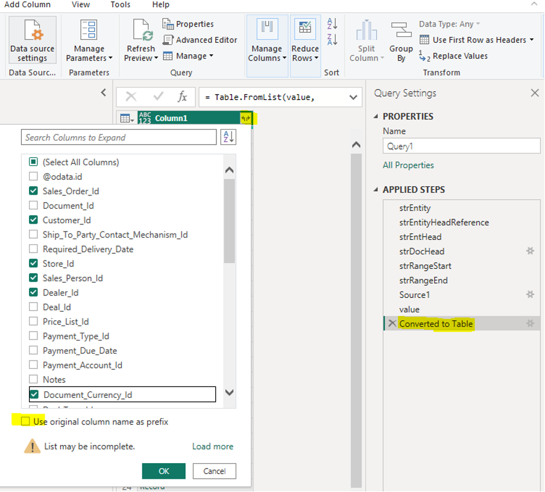<br> _Picture 6_ <br>
   
   This assumes that the string in **strSelectFields** is empty (```strSelectFields=""```).
   
   If it is filled with certain fields like:
   
   ```
   strSelectFields="Sales_Order_Id, Customer_Id, Store_Id, Sales_Person_Id, Dealer_Id, Document_Currency_Id",
   ```
   
   then only these will be visible, and only they will be returned from TableAPI, which will save time in data transfer and speed up loading.
   
   For this reason, specifying the field names to be returned by the query is highly recommended.
   
   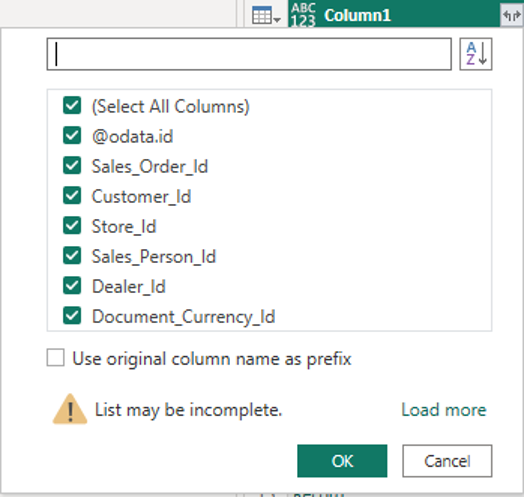<br> _Picture 7_ <br>

There is one line in the code above:

```
value = if List.NonNullCount(ResultList) = 0 then List.Union({ResultList, {null}}) else ResultList,
```
    
which may seem redundant but is very important for the synchronization to run without error. It is used to check the returned result, and if no data is returned, an empty line is added. Missing data causes an error in the next steps of conversion to the tabular form in which we need the data. An error would occur if any information is missing in any incremental refresh period.

Executing the code above will result in sending the following data fetch command:

```
HTTP GET /tableapi/data/Crm_Sales_Orders?$filter=Document_Reference/Void eq false and Document_Reference/State ge 30 and Document_Reference/Document_Date ge 2015-01-01T00:00:00Z and Document_Reference/Document_Date le 2024-01-09T00:00:00Z&$select=Sales_Order_Id, Customer_Id, Store_Id, Sales_Person_Id, Dealer_Id, Document_Currency_Id&$top=500
```

The **Document_Date** filtering and the value of the **$top** parameter are determined by the parameters we have defined. This applies to PowerBI Desktop queries. When querying from online PowerBI with incremental update defined for the object, the parameter values will be automatically filled, and separate queries will be generated and executed for each update period.

Once the project is published to PowerBI, the first thing to set is chaning **TopCount** parameter to a large enough value, for example 500000000. After that, a manual **Refresh** can be run at an appropriate time as this will cause the data to be fully loaded (from the processing period set in the incremental refresh).

Let's also pay attention to the **Timeout** parameter set in this sample query:

```
Timeout=#duration(0, 2, 0, 0)
```

It is used to set the timeout of a single data download request. The above setting changes it to 2 hours. This is the maximum time given to one request (each incremental period) at a time. In PowerBI, this value defaults to 600 seconds, which can be insufficient, especially during the initial data load when the archive period data is loaded. 

The default time for a single query may not be enough if the settings are as follows:

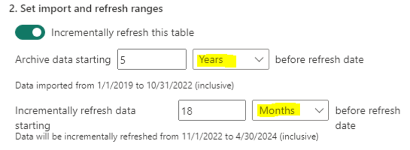<br> _Picture 8_ <br>

Archival data periods will be 1 year in size. This means the amount of data to be loaded will be very large, and the query will be slow to execute. We need to increase the timeout, as we have done in the example, or change the period to an equivalent but with a smaller size.

We can set the following:

_Archive data starting **60 Month** before refresh date_

which is equivalent to the above settings, but the period of data processed with one query will be one month. This will reduce the execution time and the probability of timeout of single queries on initial data load.

The archive period data is loaded once on the first **Refresh** after the project is published. Data loading in the periods defined by **Incrementally refresh data** is done on each Refresh, but the refresh time will not increase proportionally to the total data in the database - rather, to the volume of data in the periods being processed.

The use of **TableAPI** allows multiple queries to pull data from the database simultaneously without overloading the server and disrupting the primary operations.

### Optimized loading of custom properties

Custom properties are also used in the analyses performed in PowerBI. 

Since their volume is significant, it is very important for them to be loaded and used efficiently.

#### Optimized loading of all necessary properties

For this purpose, we use the following code defining a query named **Gen_Property_Values**:

```
let
    Source = OData.Feed(baseURL & "/tableapi/odata/", null, [Implementation="2.0"]),
    Gen_Property_Values_table = Source{[Name="Gen_Property_Values",Signature="table"]}[Data],
    #"Filtered Rows1" = Table.SelectRows(Gen_Property_Values_table, each ([Property_Id] = "18eb8480-a19b-4336-b935-c2715730f988" or [Property_Id] = "28e65696-2d8e-4e22-9932-686737235d88" or [Property_Id] = "41324c1d-6f64-4fa3-85e4-4c99fcf4f407" or [Property_Id] = "46d58fad-4ef2-409e-ba92-b5c55f7ea20b")),
    #"Removed Other Columns" = Table.SelectColumns(#"Filtered Rows1",{"Entity_Item_Id", "Property_Id", "Property_Value", "Description"}),
    #"Filtered Rows" = Table.Buffer(#"Removed Other Columns")
in
    #"Filtered Rows"
```

In this example, the four GUID feature numbers listed are randomly selected. You need to replace and supplement them with the IDs of the properties you need.

The construct:

```
... or [Property_Id] = "Guid"
```

can be reduced or expanded with more members.

**Note the following operation:**

```
#"Filtered Rows" = Table.Buffer(#"Removed Other Columns")
```
    
It specifies that the data will be statically buffered in memory. In the next operations that use as a source **Gen_Property_Values** (the query we define), data will be retrieved from the buffer in the memory which will save significant re-fetching time.

Another optimization comes from loading only the required fields listed in the **Table.SelectColumns** operation. This reduces the returned data and speeds up the query. This is possible thanks to the **Folding** support which is active when using an **OData feed** data source.

#### Dividing the loaded properties by entities to which they refer

The processing can continue by creating a new query (e.g., **Entity1_Property_Values**) with the following code:

```
let
    Source = Gen_Property_Values,
    #"Filtered Rows" = Table.SelectRows(Source, each ([Property_Id] = "41324c1d-6f64-4fa3-85e4-4c99fcf4f407" or [Property_Id] = "46d58fad-4ef2-409e-ba92-b5c55f7ea20b") and ([Property_Value] <> null and [Property_Value] <> "")),
    #"Added Custom" = Table.AddColumn(#"Filtered Rows", "Param1", each if [Property_Id]="41324c1d-6f64-4fa3-85e4-4c99fcf4f407" then [Property_Value] else null),
    #"Added Custom1" = Table.AddColumn(#"Added Custom", "Param2", each if [Property_Id] = "46d58fad-4ef2-409e-ba92-b5c55f7ea20b" then [Property_Value] else null),
    #"Added Custom2" = Table.AddColumn(#"Added Custom1", "Descr1", each if [Property_Id] = "41324c1d-6f64-4fa3-85e4-4c99fcf4f407" then [Description] else null),
    #"Added Custom3" = Table.AddColumn(#"Added Custom2", "Descr2", each if [Property_Id]="46d58fad-4ef2-409e-ba92-b5c55f7ea20b" then [Description] else null),
    #"Grouped Rows" = Table.Group(#"Added Custom3", {"Entity_Item_Id"}, {{"Par1", each List.Max([Param1]), type nullable text}, {"Descr1", each List.Max([Descr1]), type nullable text}, {"Par2", each List.Max([Param2]), type nullable text}, {"Descr2", each List.Max([Descr2]), type nullable text}})
in
    #"Grouped Rows"
```

In the first step, select the **Gen_Property_Values** query created earlier as the data source, which will buffer the data load.

The next step performs filtering, taking the values of only two of the properties that apply to a single entity to optimize and reduce the data to process. They must not be null or empty (""). If needed, the filtering list can be expanded or reduced according to the properties being processed and already loaded by the previous query.

In the following steps, new columns are created that contain only values for a particular **Property_Id**. 

This is necessary to prepare data for grouping by **Entity_Item_Id**, which will convert the table into one with no more than one row for each entity. Afterwards, you can link it to the entity table to which the custom properties apply. These steps must be edited or completed for the specific **Property_Id** that are processed.

As a final step, grouping by **Entity_Item_Id** is performed and data is ready to be associated with the entity data it refers to. If you add the link to the same query, the linking dialog would look something like this:

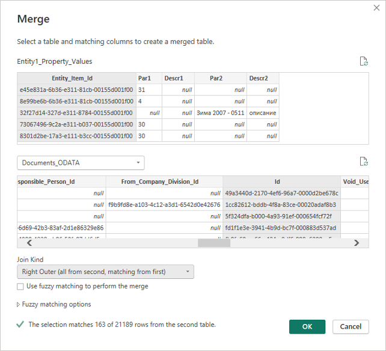<br> _Picture 9_ <br>

The link must be **Outher** (not all records in the entity table have a match in the table with feature values), and in this case, it is **Right** because the base table where all data is stored is second (named **Documents_ODATA**).

If we add the properties in **Entity1_Property_Values** to **Documents_ODATA**, then we would have a **Join Kind** of type **Left Outer**.

> [!WARNING]
> **Reading data from the Gen_Property_Values_Table is always slow because it triggers a scan (full crawl) of the table, which is very large. This has a very negative impact on the SQL server and slows down the updating of PowerBI. Therefore, it is imperative to follow the recommended approach shown here! There may be other optimal methods, but the table scanning and large execution time of a query should always be considered.** <br><br>
> **The only exception might be if you filter by a list of values for Entity_Item_Id, in which case the query will execute quickly as it will use SEEK in the database. However, due to the nature of BI, this option is likely not practical.**

When reading custom properties, there is no way to filter by the date of the document they refer to and therefore no way to use incremental refresh. That is why the example uses the standard **OData feed** as a data source.

### PowerBI setup after uploading the project

These settings are required to set the access rights when connecting to the data source (in this case, TableAPI). It is important to configure the correct values for these settings to avoid creating additional problems and disturbances when loading the data.

For each source (table) read from TableAPI when using the **WEB Content** access method, it is necessary to set the rights separately.

For a source using **OData Feed**, the necessary access rights are set once. Only the **Basic authentication** method is supported!

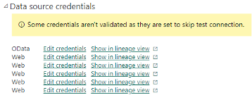<br> _Picture 10_ <br>

For these settings, it is necessary to check the "**Skip test connection**" box, as shown in the picture:

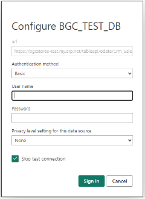<br> _Picture 11_ <br>

For the **OData** source, you may leave this box empty. It is even advisable to first set the access for the OData source with an empty check box, verifying that the correct credentials (user, password) are set. If there is a problem, you will receive a notification. If everything is alright, you can proceed to configure the access for the other sources in the same way, but with the check box selected.

**As of version 23.2 SP4**, it is no longer necessary to uncheck "**Skip test connection**", because the system behavior when disconnecting from TableAPI has been adjusted.

Before the first run which loads the data after uploading the project, it is necessary to set the "**TopCount**" parameter to a value that does not limit the volume of the loaded data (e.g. 500000000, as shown in the picture).  Be careful not to set a too large value for the parameter. The maximum allowed value is 2^31 (MAXINT), after which the query will return an error.

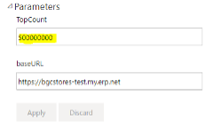<br> _Picture 12_ <br>

If for whatever reason the data source has been renamed, this can be easily corrected here by changing the "**baseURL**" parameter to match the correct one, without needing to make project corrections and re-uploads.

### Conclusion

Through these techniques, you are ready to take advantage of PowerBI's incremental refresh capability, which makes the refresh time relatively constant and proportional to the growth of data in the last selected refresh periods.

This capability has been tested in practice with 4 parallel connections, which did not lead to a significant load on the TableAPI site, AppServer, or SQL Server. We can assume that Refresh even with 5-10 connections will still be within the permissible load limits and will not significantly affect the system's performance.

However, it is best to track the specific refresh process to determine its impact and the load it causes. This will make it possible to choose appropriate values for the number of parallel refresh requests that are possible without interfering with the normal system operations.
